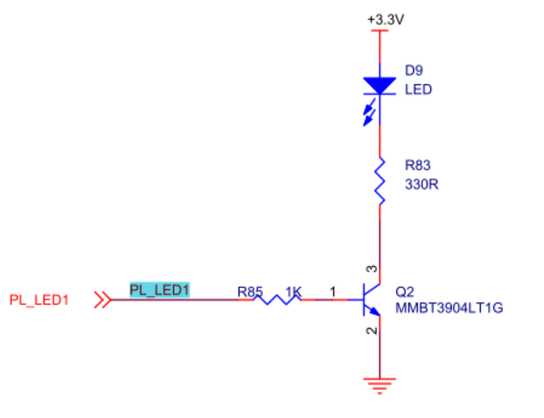
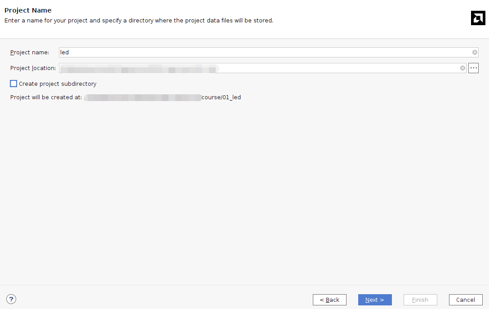
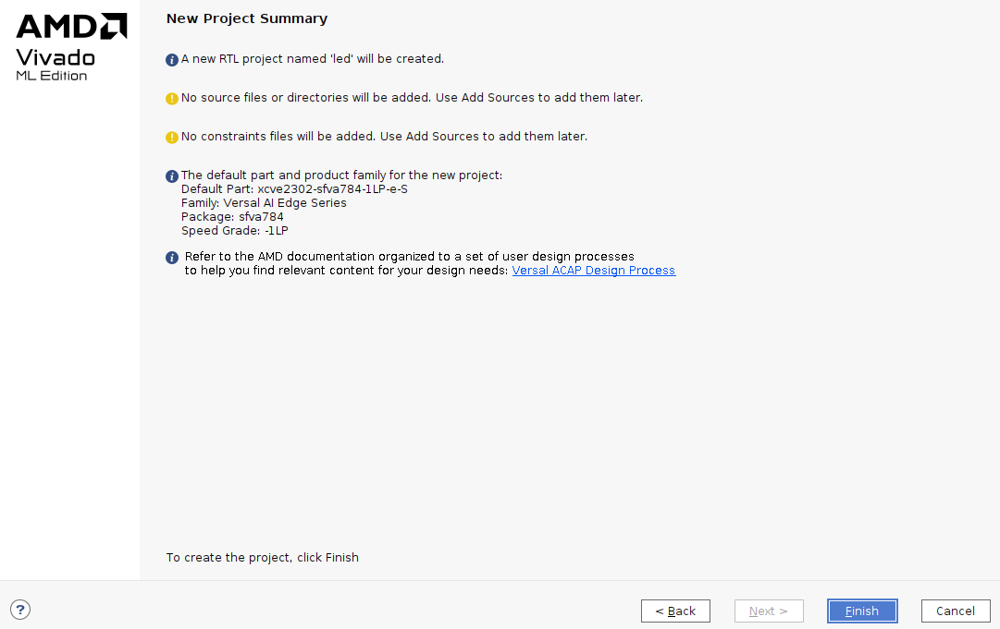
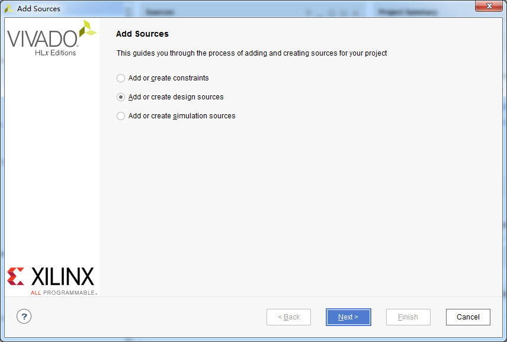
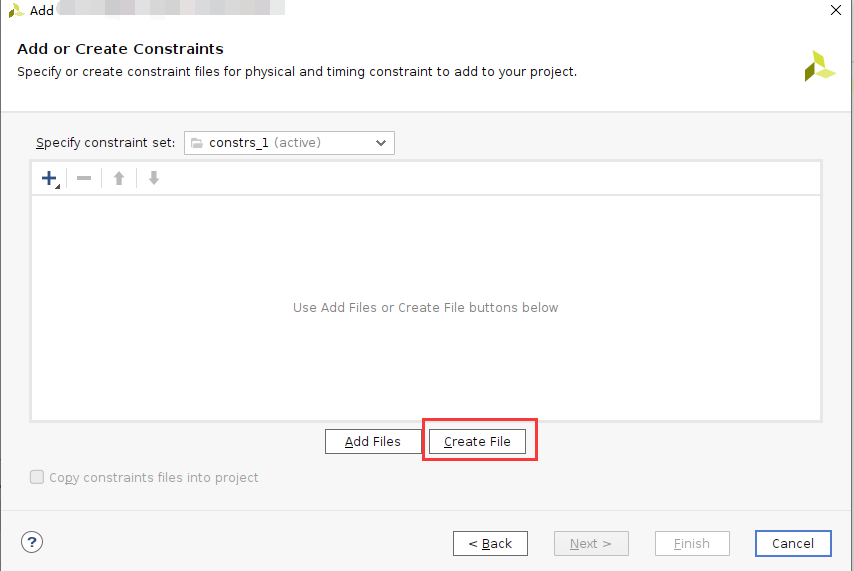
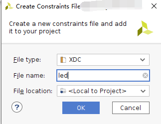
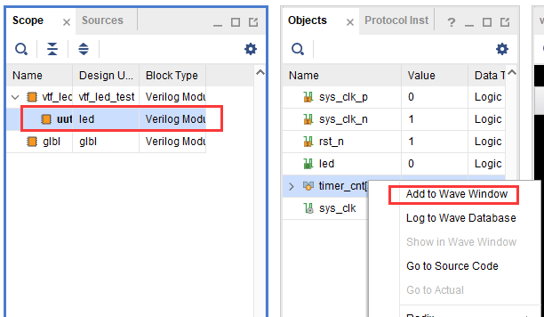
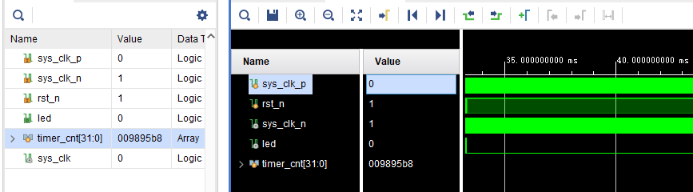
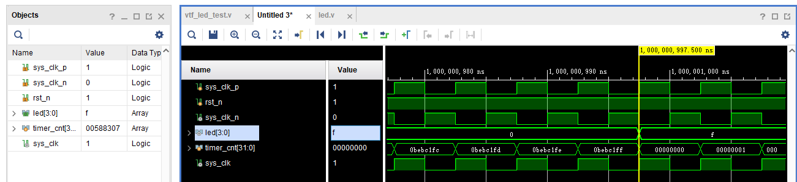

第二章 PL的"Hello World"LED实验
================================

**实验Vivado工程为“led”。**

对于Versal来说PL（FPGA）开发是至关重要的，这也是Versal比其他ARM的有优势的地方，可以定制化很多ARM端的外设，在定制ARM端的外设之前先让我们通过一个LED例程来熟悉PL（FPGA）的开发流程，熟悉Vivado软件的基本操作，这个开发流程和不带ARM的FPGA芯片完全一致。

在本例程中，我们要做的是LED灯控制实验，每秒钟控制开发板上的LED灯翻转一次，实现亮、灭、亮、灭的控制。

2.1 LED硬件介绍
----------------

开发板的PL部分连接了1个红色的用户LED灯。这1个灯完全由PL控制。如果PL_LED1为高电平，三级管导通，灯则会亮，否则会灭。

2.2 创建Vivado工程
--------------------

1) 启动Vivado，在Windows中可以通过双击Vivado快捷方式启动

2) 在Vivado开发环境里点击“Create New Project”，创建一个新的工程。

.. image:: images/media/image30.png
   :width: 4.90245in
   :height: 3.54576in

3) 弹出一个建立新工程的向导，点击“Next”

.. image:: images/media/image31.png
   :width: 4.82126in
   :height: 4.08408in

4) 在弹出的对话框中输入工程名和工程存放的目录，我们这里取一个led的工程名。需要注意工程路径“Project
   location”不能有中文空格，路径名称也不能太长。

5) 在工程类型中选择“RTL Project”

.. image:: images/media/image33.png
   :width: 5.26181in
   :height: 3.32917in

6) 目标语言“Target
   language”选择“Verilog”，虽然选择Verilog，但VHDL也可以使用，支持多语言混合编程。

.. image:: images/media/image34.png
   :width: 5.20556in
   :height: 3.27708in

7) 点击“Next”，不添加任何文件

.. image:: images/media/image35.png
   :width: 5.39514in
   :height: 3.34097in

8) 选择“xc2302-sfva784-1LP-e-S”

.. image:: images/media/image36.png
   :width: 5.13403in
   :height: 4.59444in

9) 点击“Finish”就可以完成以后名为“led”工程的创建。

10) Vivado软件界面

.. image:: images/media/image38.png
   :width: 4.61346in
   :height: 3.97672in

2.3 创建Verilog HDL文件点亮LED
-------------------------------

1) 点击Project Manager下的Add Sources图标（或者使用快捷键Alt+A）

.. image:: images/media/image39.png
   :width: 3.88736in
   :height: 2.26719in

2) 选择添加或创建设计源文件“Add or create design sources”,点击“Next”

3) 选择创建文件“Create File”

.. image:: images/media/image41.png
   :width: 5.19748in
   :height: 3.5094in

4) 文件名“File name”设置为“led”，点击“OK”

.. image:: images/media/image42.png
   :width: 4.86244in
   :height: 3.28317in

5) 点击“Finish”,完成“led.v”文件添加

.. image:: images/media/image43.png
   :width: 4.89769in
   :height: 3.30698in

6) 在弹出的模块定义“Define
   Module”,中可以指定“led.v”文件的模块名称“Module
   name”,这里默认不变为“led”，还可以指定一些端口，这里暂时不指定，点击“OK”。

.. image:: images/media/image44.png
   :width: 4.48908in
   :height: 3.21372in

7) 在弹出的对话框中选择“Yes”

.. image:: images/media/image45.png
   :width: 4.33533in
   :height: 3.10366in

8) 双击“led.v”可以打开文件，然后编辑

.. image:: images/media/image46.png
   :width: 4.52898in
   :height: 3.45462in

9) 编写“led.v”,这里定义了一个32位的寄存器timer,
   用于循环计数0~199999999(1秒钟), 计数到199999999(1秒)的时候,
   寄存器timer变为0，并翻转四个LED。这样原来LED是灭的话，就会点亮，如果原来LED为亮的话，就会熄灭。由于输入时钟为200MHz的差分时钟，因此需要添加IBUFDS原语连接差分信号，编写好后的代码如下：

+-----------------------------------------------------------------------+
| \`timescale 1ns **/** 1ps                                             |
|                                                                       |
| **module** led\ **(**                                                 |
|                                                                       |
| //Differential system clock                                           |
|                                                                       |
| **input** sys_clk_p\ **,**                                            |
|                                                                       |
| **input** sys_clk_n\ **,**                                            |
|                                                                       |
| **input** rst_n\ **,**                                                |
|                                                                       |
| **output** **reg** led                                                |
|                                                                       |
| **);**                                                                |
|                                                                       |
| **reg[**\ 31\ **:**\ 0\ **]** timer_cnt\ **;**                        |
|                                                                       |
| **wire** sys_clk **;**                                                |
|                                                                       |
| IBUFDS IBUFDS_inst **(**                                              |
|                                                                       |
| **.**\ O\ **(**\ sys_clk\ **),** // Buffer output                     |
|                                                                       |
| **.**\ I\ **(**\ sys_clk_p\ **),** // Diff_p buffer input (connect    |
| directly to top-level port)                                           |
|                                                                       |
| **.**\ IB\ **(**\ sys_clk_n\ **)** // Diff_n buffer input (connect    |
| directly to top-level port)                                           |
|                                                                       |
| **);**                                                                |
|                                                                       |
| **always@(posedge** sys_clk\ **)**                                    |
|                                                                       |
| **begin**                                                             |
|                                                                       |
| **if** **(!**\ rst_n\ **)**                                           |
|                                                                       |
| **begin**                                                             |
|                                                                       |
| led **<=** 1'b0 **;**                                                 |
|                                                                       |
| timer_cnt **<=** 32'd0 **;**                                          |
|                                                                       |
| **end**                                                               |
|                                                                       |
| **else** **if(**\ timer_cnt **>=** 32'd199_999_999\ **)** //1 second  |
| counter, 200M-1=199999999                                             |
|                                                                       |
| **begin**                                                             |
|                                                                       |
| led **<=** **~**\ led\ **;**                                          |
|                                                                       |
| timer_cnt **<=** 32'd0\ **;**                                         |
|                                                                       |
| **end**                                                               |
|                                                                       |
| **else**                                                              |
|                                                                       |
| **begin**                                                             |
|                                                                       |
| led **<=** led\ **;**                                                 |
|                                                                       |
| timer_cnt **<=** timer_cnt **+** 32'd1\ **;**                         |
|                                                                       |
| **end**                                                               |
|                                                                       |
| **end**                                                               |
|                                                                       |
| **endmodule**                                                         |
+-----------------------------------------------------------------------+

10) 编写好代码后保存

2.4 添加管脚约束
-----------------

Vivado使用的约束文件格式为xdc文件。xdc文件里主要是完成管脚的约束,时钟的约束,
以及组的约束。这里我们需要对led.v程序中的输入输出端口分配到FPGA的真实管脚上。

1) 新建约束文件

.. image:: images/media/image47.png
   :width: 5.99722in
   :height: 2.96736in

2) Create File

3) 将复位信号rst_n绑定到PL端的按键，给LED和时钟分配管脚、电平标准，约束如下

.. image:: images/media/image50.png
   :width: 4.82986in
   :height: 1.96389in

+-----------------------------------------------------------------------+
| set_property PACKAGE_PIN AB23 [get_ports sys_clk_p]                   |
|                                                                       |
| set_property PACKAGE_PIN F21 [get_ports rst_n]                        |
|                                                                       |
| set_property PACKAGE_PIN E20 [get_ports led]                          |
|                                                                       |
| set_property IOSTANDARD LVCMOS15 [get_ports led]                      |
|                                                                       |
| set_property IOSTANDARD LVCMOS15 [get_ports rst_n]                    |
|                                                                       |
| set_property IOSTANDARD LVDS15 [get_ports sys_clk_p]                  |
|                                                                       |
| create_clock -period 5.000 -name sys_clk_p -waveform {0.000 2.500}    |
| [get_ports sys_clk_p]                                                 |
+-----------------------------------------------------------------------+

2.5 生成pdi文件
-----------------

1) 编译的过程可以细分为综合、布局布线、生成bit文件等，这里我们直接点击“Generate
   Device Image”,直接生成pdi文件。

.. image:: images/media/image51.png
   :width: 1.8375in
   :height: 0.75069in

2) 在弹出的对话框中可以选择任务数量，这里和CPU核心数有关，一般数字越大，编译越快，点击“OK”

.. image:: images/media/image52.png
   :width: 2.2739in
   :height: 1.78158in

3)  编译的时候发现有报错

    .. image:: images/media/image53.png
       :width: 5.98611in
       :height: 0.78264in

    [DRC CIPS-2] Versal CIPS exists check - wdi: Versal designs must
    contain a CIPS IP in the netlist hierarchy to function properly.
    Please create an instance of the CIPS IP and configure it. Without a
    CIPS IP in the design, Vivado will not generate a CDO for the PMC,
    an elf for the PLM.

    从报错来看，versal设计是必须包含CIPS的，也就是PS端，因此需要添加CIPS核。

4)  选择Create Block Design

    .. image:: images/media/image54.png
       :width: 2.26458in
       :height: 2.29792in

    .. image:: images/media/image55.png
       :width: 3.19792in
       :height: 1.73125in

5)  添加CIPS

    .. image:: images/media/image56.png
       :width: 5.19167in
       :height: 2.67778in

    .. image:: images/media/image57.png
       :width: 2.63333in
       :height: 2.09792in

6)  双击CIPS，选择PL_Subsystem，只有PL端的逻辑

    .. image:: images/media/image58.png
       :width: 4.18542in
       :height: 3.7875in

7)  右键Generate Output products

    .. image:: images/media/image59.png
       :width: 2.89653in
       :height: 1.85833in

    .. image:: images/media/image60.png
       :width: 2.08403in
       :height: 2.85278in

8)  之后右键创建HDL

    .. image:: images/media/image61.png
       :width: 3.44167in
       :height: 1.77569in

    .. image:: images/media/image62.png
       :width: 3.06875in
       :height: 1.50694in

9)  在led.v中例化PS端文件

    .. image:: images/media/image63.png
       :width: 1.49444in
       :height: 0.55972in

    .. image:: images/media/image64.png
       :width: 3.28958in
       :height: 1.52986in

10) 之后再Generate
    Bitstream，编译中没有任何错误，编译完成，弹出一个对话框让我们选择后续操作，可以选择“Open
    Hardware Manger”，当然，也可以选择“Cancel”，我们这里选择
    “Cancel”，先不下载。

.. image:: images/media/image65.png
   :width: 2.51597in
   :height: 1.51181in

2.6 Vivado仿真
---------------

接下来我们不妨小试牛刀，利用Vivado自带的仿真工具来输出波形验证流水灯程序设计结果和我们的预想是否一致（注意：在生成bit文件之前也可以仿真）。具体步骤如下：

1. 设置Vivado的仿真配置，右击SIMULATION中Simulation Settings。

.. image:: images/media/image66.png
   :width: 2.71162in
   :height: 2.82275in

2. 在Simulation
   Settings窗口中进行如下图来配置，这里设置成50ms（根据需要自行设定）,其它按默认设置，单击OK完成。

.. image:: images/media/image67.png
   :width: 4.16967in
   :height: 3.68114in

3. 添加激励测试文件，点击Project Manager下的Add
   Sources图标,按下图设置后单击Next。

.. image:: images/media/image68.png
   :width: 4.24388in
   :height: 2.19655in

4. 点击Create File生成仿真激励文件。

.. image:: images/media/image69.png
   :width: 3.47146in
   :height: 2.72528in

在弹出的对话框中输入激励文件的名字，这里我们输入名为vtf_led_test。

.. image:: images/media/image70.png
   :width: 2.21088in
   :height: 1.80096in

5. 点击Finish按钮返回。

.. image:: images/media/image71.png
   :width: 3.95375in
   :height: 3.03139in

这里我们先不添加IO Ports，点击OK。

.. image:: images/media/image72.png
   :width: 3.1395in
   :height: 2.2426in

在Simulation
Sources目录下多了一个刚才添加的vtf_led_test文件。双击打开这个文件，可以看到里面只有module名的定义，其它都没有。

.. image:: images/media/image73.png
   :width: 4.14019in
   :height: 2.71368in

6. 接下去我们需要编写这个vtf_led_test.v文件的内容。首先定义输入和输出信号，然后需要实例化led_test模块，让led_test程序作为本测试程序的一部分。再添加复位和时钟的激励。完成后的vtf_led_test.v文件如下：

+-----------------------------------------------------------------------+
| \`timescale 1ns **/** 1ps                                             |
|                                                                       |
| // Module Name: vtf_led_test                                          |
|                                                                       |
|                                                                       |
| **module** vtf_led_test\ **;**                                        |
|                                                                       |
| // Inputs                                                             |
|                                                                       |
| **reg** sys_clk_p\ **;**                                              |
|                                                                       |
| **reg** rst_n **;**                                                   |
|                                                                       |
| **wire** sys_clk_n\ **;**                                             |
|                                                                       |
| // Outputs                                                            |
|                                                                       |
| **wire** led\ **;**                                                   |
|                                                                       |
| // Instantiate the Unit Under Test (UUT)                              |
|                                                                       |
| led uut **(**                                                         |
|                                                                       |
| **.**\ sys_clk_p\ **(**\ sys_clk_p\ **),**                            |
|                                                                       |
| **.**\ sys_clk_n\ **(**\ sys_clk_n\ **),**                            |
|                                                                       |
| **.**\ rst_n\ **(**\ rst_n\ **),**                                    |
|                                                                       |
| **.**\ led\ **(**\ led\ **)**                                         |
|                                                                       |
| **);**                                                                |
|                                                                       |
| **initial**                                                           |
|                                                                       |
| **begin**                                                             |
|                                                                       |
| // Initialize Inputs                                                  |
|                                                                       |
| sys_clk_p **=** 0\ **;**                                              |
|                                                                       |
| rst_n **=** 0\ **;**                                                  |
|                                                                       |
| // Wait for global reset to finish                                    |
|                                                                       |
| **#**\ 1000\ **;**                                                    |
|                                                                       |
| rst_n **=** 1\ **;**                                                  |
|                                                                       |
| **end**                                                               |
|                                                                       |
| //Create clock                                                        |
|                                                                       |
| **always** **#**\ 2.5 sys_clk_p **=** **~** sys_clk_p\ **;**          |
|                                                                       |
| **assign** sys_clk_n **=** **~**\ sys_clk_p **;**                     |
|                                                                       |
| **endmodule**                                                         |
+-----------------------------------------------------------------------+

7) 编写好后保存，vtf_led_test.v自动成了这个仿真Hierarchy的顶层了，它下面是设计文件led_test.v。

.. image:: images/media/image74.png
   :width: 2.63408in
   :height: 2.45107in

8) 点击Run Simulation按钮，再选择Run Behavioral
   Simulation。这里我们做一下行为级的仿真就可以了。

.. image:: images/media/image75.png
   :width: 2.88031in
   :height: 3.23482in

如果没有错误，Vivado中的仿真软件开始工作了。

9)
在弹出仿真界面后如下图，界面是仿真软件自动运行到仿真设置的50ms的波形。

.. image:: images/media/image76.png
   :width: 6.00417in
   :height: 1.23611in

由于LED[3：0]在程序中设计的状态变化时间长，而仿真又比较耗时，在这里观测timer[31:0]计数器变化。把它放到Wave中观察(点击Scope界面下的uut，
再右键选择Objects界面下的timer， 在弹出的下拉菜单里选择Add Wave
Window)。

添加后timer显示在Wave的波形界面上，如下图所示。

10) 点击如下标注的Restart按钮复位一下，再点击Run
All按钮。（需要耐心！！！），可以看到仿真波形与设计相符。（注意：仿真的时间越长，仿真的波形文件占用的磁盘空间越大，波形文件在工程目录的xx.sim文件夹）

.. image:: images/media/image79.png
   :width: 4.16502in
   :height: 1.82527in

我们可以看到led的信号会变成1，说明LED灯会变亮。

2.7 下载
----------

1) 连接好开发板的JTAG接口，给开发板上电，注意拔码开关要选择JTAG模式，也就是全部拔到”ON”，“ON”代表的值是0，不用JTAG模式，下载会报错。

.. image:: images/media/image81.png
   :width: 5.50347in
   :height: 3.82569in

.. image:: images/media/image82.png
   :width: 4.09375in
   :height: 2.23403in

2) 在“HARDWARE MANAGER”界面点击“Auto Connect”，自动连接设备

.. image:: images/media/image83.png
   :width: 3.01461in
   :height: 2.12162in

3) 选择芯片，右键“Program Device...”

.. image:: images/media/image84.png
   :width: 3.34583in
   :height: 2.10347in

4) 在弹出窗口中点击“Program”

.. image:: images/media/image85.png
   :width: 3.53194in
   :height: 1.88056in

5) 等待下载

.. image:: images/media/image86.png
   :width: 3.18855in
   :height: 0.87404in

6) 下载完成以后，我们可以看到PL
   LED开始每秒变化一次。到此为止Vivado简单流程体验完成。后面的章节会介绍如果把程序烧录到Flash，需要PS系统的配合才能完成，只有PL的工程不能直接烧写Flash。在”体验ARM，裸机输出”Hello
   World”一章的常见问题中有介绍。

2.8 实验总结
--------------

本章节介绍了如何在PL端开发程序，包括工程建立，约束，仿真等方法，在后续的代码开发方式中皆可参考此方法。

