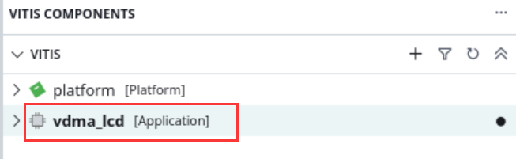
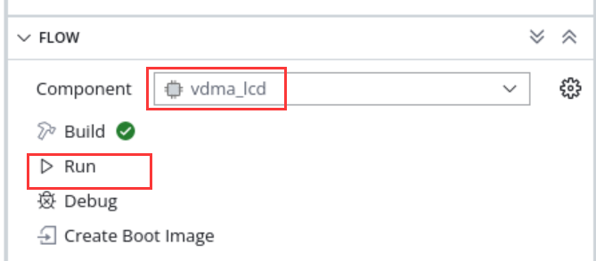
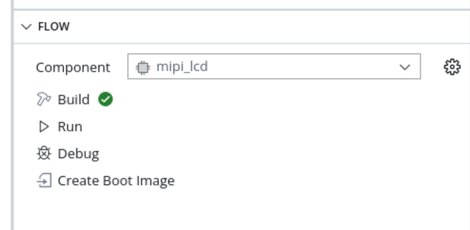
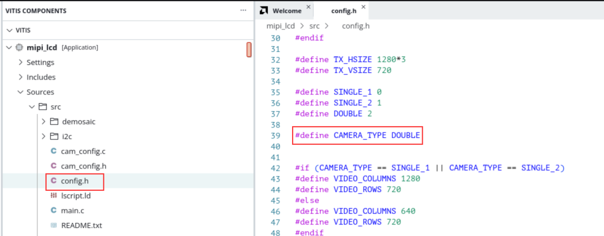
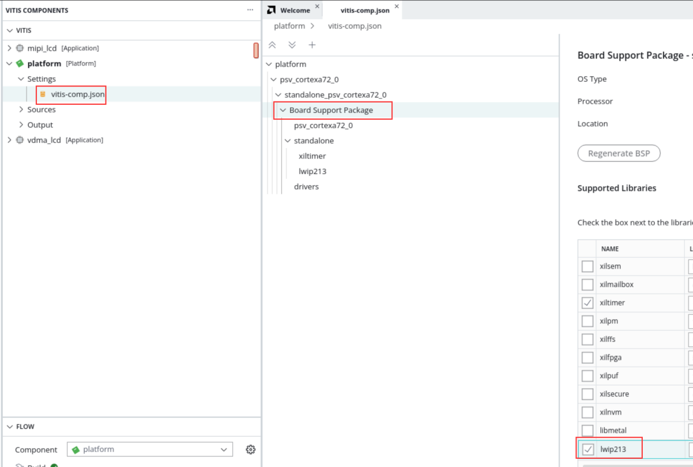
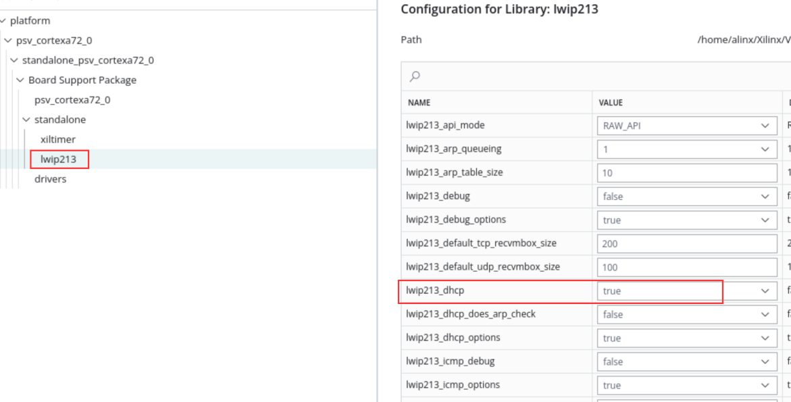

第八章 整体工程及实验
=======================

本章将板卡大部分外设集成到Vivado工程。

8.1 Vivado工程建立
--------------------

整体框图如下，两路MIPI摄像头通过VDMA写入DDR4，LVDS
LCD通过VDMA从DDR4读出图像数据。具体搭建过程不再描述，可通过TCL脚本恢复Vivado工程。

.. image:: images/media/image240.png
   :width: 4.925in
   :height: 3.88403in

8.2 Vitis实验
---------------

8.2.1 基于VDMA的LVDS LCD显示实验
~~~~~~~~~~~~~~~~~~~~~~~~~~~~~~~~~~

本实验主要功能是ARM在DDR中制作color bar，VDMA读取这块空间，发送给LVDS
LCD显示模块。下载程序：

显示结果如下：

.. image:: images/media/image132.png
   :width: 5.35347in
   :height: 3.80694in

8.2.2 MIPI摄像头采集显示实验
~~~~~~~~~~~~~~~~~~~~~~~~~~~~~~

本实验主要功能是配置单个或两个MIPI摄像头，将图像显示到LCD上面，也是通过VDMA实现。

.. image:: images/media/image243.png
   :width: 3.17083in
   :height: 2.15069in

Run下载程序

若是想显示单个或两个摄像头，可以修改config.h里的宏定义，重新编译下载即可

显示效果

.. image:: images/media/image246.png
   :width: 4.16944in
   :height: 3.74514in

8.2.3 MIPI摄像头双目采集以太网传输实验
~~~~~~~~~~~~~~~~~~~~~~~~~~~~~~~~~~~~~~~~

前面介绍了MIPI摄像头的LCD显示，但有些场合下，需要把视频传输到上位机，便可以利用以太网进行数据的传输，本章利用LWIP的udp将摄像头数据传输到上位机。

下面介绍LWIP部分内容，与上位机通信时，采用UDP传输，在UDP数据包中自定义了协议，如下所示：

一、获取板卡信息

（1）询问命令（共5字节，由上位机通过以太网发送）

+--------------+--------------+---------------------------------------+
| 字节数       | 1            | 4                                     |
+--------------+--------------+---------------------------------------+
| 命令信息     | Header       | 0x00020001                            |
+--------------+--------------+---------------------------------------+

（2）应答命令（共16字节，由开发板通过以太网发送）

+----------+-----------------------------------------------------------+
| 字节数   | 命令信息                                                  |
+----------+-----------------------------------------------------------+
| 1        | Header|0x01                                               |
+----------+-----------------------------------------------------------+
| 4        | 0x00020001                                                |
+----------+-----------------------------------------------------------+
| 6        | 板卡MAC地址                                               |
+----------+-----------------------------------------------------------+
| 4        | 板卡IP地址                                                |
+----------+-----------------------------------------------------------+
| 1        | 0x02                                                      |
+----------+-----------------------------------------------------------+

二、获取数据

（1）控制命令（由上位机发送数据请求）

+----------+-----------------------------------------------------------+
| 字节数   | 命令信息                                                  |
+----------+-----------------------------------------------------------+
| 1        | Header                                                    |
+----------+-----------------------------------------------------------+
| 4        | 0x00020002                                                |
+----------+-----------------------------------------------------------+
| 6        | 板卡MAC地址                                               |
+----------+-----------------------------------------------------------+
| 1        | 摄像头通道选择，数值1代表仅打开摄像                       |
|          | 头1，数值2代表仅打开摄像头2，数值3代表同时打开两个摄像头  |
+----------+-----------------------------------------------------------+
| 1        | 启动信号，0表示关闭上位图像显示，其他表示打开图像显示     |
+----------+-----------------------------------------------------------+

（2）应答命令（由开发板发送）

+----------+-----------------------------------------------------------+
| 字节数   | 命令信息                                                  |
+----------+-----------------------------------------------------------+
| 1        | Header|0x 01                                              |
+----------+-----------------------------------------------------------+
| 3        | 0x 000200                                                 |
+----------+-----------------------------------------------------------+
| 1        | 通道标识，数值2代表摄像头1，数值3代表摄像头2              |
+----------+-----------------------------------------------------------+
| 3        | 序列号，以太网包序号，用于上位机识别                      |
+----------+-----------------------------------------------------------+
| N        | 图像数据                                                  |
+----------+-----------------------------------------------------------+

每个UDP包都包含有Header，在第一个字节，其格式如下：

+-----------------------+----------------------+----------------------+
| 比特位                | 值（0）              | 值（1）              |
+-----------------------+----------------------+----------------------+
| bit 0                 | 查询或控制           | 应答                 |
+-----------------------+----------------------+----------------------+
| bit1~bit7             | 随机数据             |                      |
+-----------------------+----------------------+----------------------+

注：当应答时，高7位随机数据保持不变，bit0设置为1

工作流程为：

1) 上位机发送询问命令

2) 开发板应答询问

3) 上位机发送控制命令请求数据

4) 开发板发送数据

5) 步骤3和4循环

实验步骤
^^^^^^^^

1. 如果在vitis中勾选lwip库

并且做参数配置

.. image:: images/media/image249.png
   :width: 4.04792in
   :height: 2.69861in

.. image:: images/media/image250.png
   :width: 3.94028in
   :height: 2.18611in

重新编译platform

.. image:: images/media/image251.png
   :width: 3.89931in
   :height: 1.09861in

2. Build工程，连接好板子摄像头，电源，串口，PS端网口ETH1，然后点击Run下载程序

   .. image:: images/media/image252.png
      :width: 5.53819in
      :height: 3.85764in

   .. image:: images/media/image253.png
      :width: 4.06181in
      :height: 1.75486in

3. 如果有DHCP服务器，会自动分配IP给开发板；如果没有DHCP服务器，默认开发板IP地址为192.168.1.10，需要将PC的IP地址设为同一网段，如下图所示。同时要确保网络里没有192.168.1.10的IP地址，否则会造成IP冲突，导致无法显示图像。可以在板子未上电前在CMD里输入ping
   192.168.1.10查看是否能ping通，如果ping通，说明网络中有此IP地址，就无法验证。

..

   没有问题之后打开串口软件。

.. image:: images/media/image254.png
   :width: 3.16215in
   :height: 3.95585in

4. 串口打印信息如下，检测出网卡速度，设置的IP地址

.. image:: images/media/image255.png
   :width: 5.41042in
   :height: 4.34167in

5. 打开Vivado工程文件夹，打开videoshow.exe

.. image:: images/media/image256.png
   :width: 1.08889in
   :height: 0.16181in

软件扫描到两个摄像头，可通过勾选来选择相应的摄像头显示，点击播放

.. image:: images/media/image257.png
   :width: 4.5375in
   :height: 3.54931in

显示效果如下，如果想重新选择显示通路，在软件屏幕上双击，回到选择界面，再次选择要显示的图像。

.. image:: images/media/image258.png
   :width: 5.98889in
   :height: 2.35486in

6. 打开任务管理器，可以看到网络带宽为750Mbps左右

.. image:: images/media/image259.png
   :width: 4.40208in
   :height: 3.85833in
