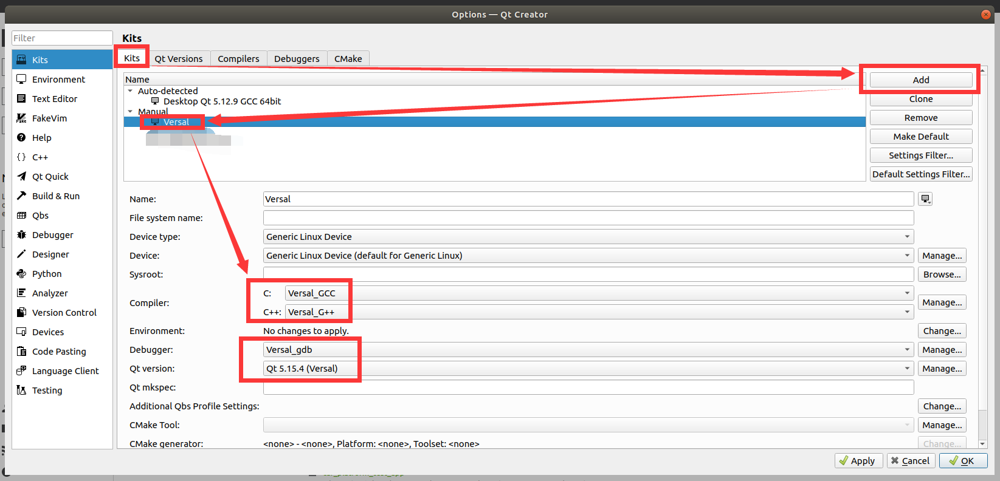
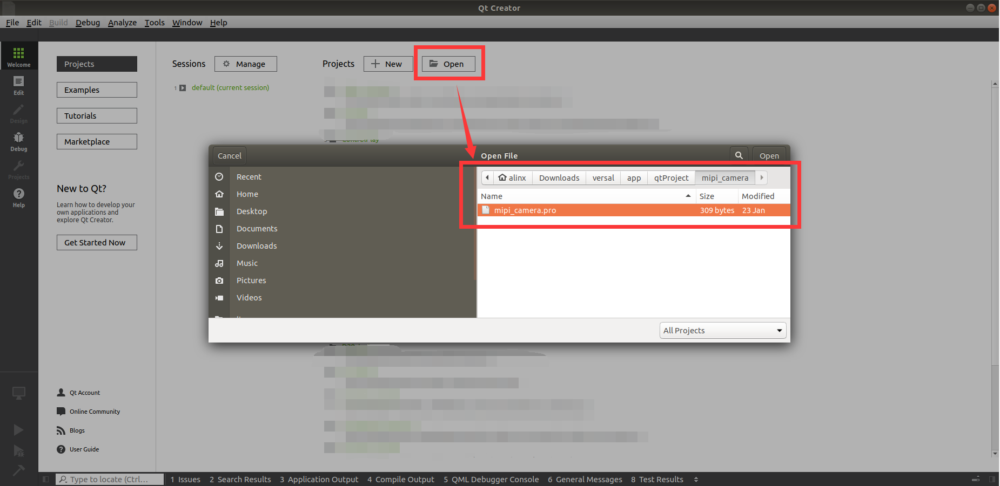

# 安装QT和OPENCV库以及在QTCreator中设置编译环境
## 安装QT和OPENCV库
- Petalinux工程编译完成后执行命令:`petalinux-build --sdk`以获得sdk.sh。编译sdk.h比较耗时，可以下载我们编译好的[sdk.sh](http://www.alinx.vip:81/extra_support%2F2023_2_sdk_sh%2Fsdk.sh)。把sdk.sh拷贝到QTCreator所在的Ubuntu系统中，并在sdk.sh所在的路径打开终端，执行命令:
`chmod +x ./sdk.sh && ./sdk.sh`

- 提示输入安装路径，这里我使用默认路径安装，安装完成后在对应的路径中可以看到这些文件:\

- 解压[opencv4_include.tar.gz](../../libs/opencv4_include.tar.gz)，把解压获得的 *opencv4* 文件夹递归替换掉下图路径中的同名文件夹:\

---
## 在QTCreator中设置编译环境

- 打开QTCreator，点击上方菜单栏中的*Tools* ，选择*Options* :

- 用之前安装的sdk.sh得到的库来添加一个 *Kits* :
\
\
\
\
\
点击OK保存设置。
- 打开一个QT工程，以[mipi_camera](../../applications/qtProject/mipi_camera)为例:\
\

- 选择Versal的Kits来编译:\

- 在编译结果路径中可以看到可执行文件\

---
---
- 访问[ALINX官方网站](https://www.alinx.com)以获取更多信息。

