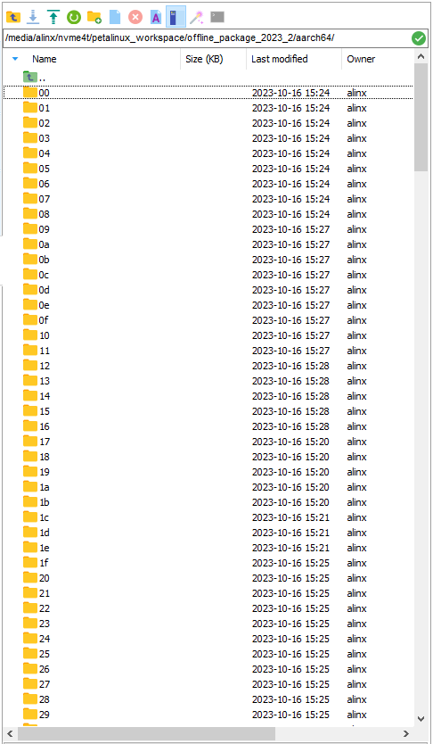
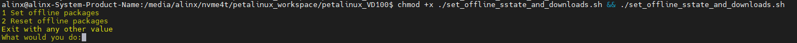
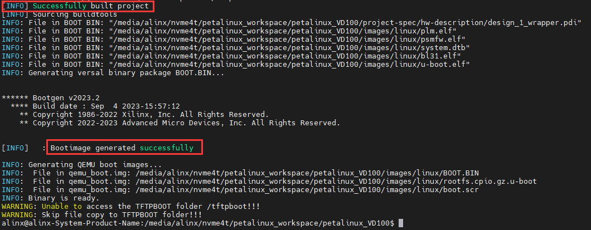
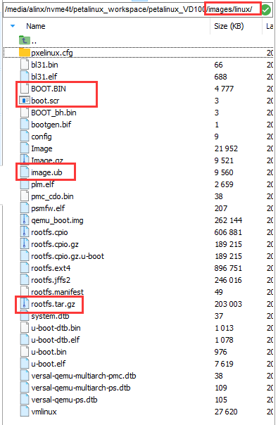

## About PETALINUX
---
### Preface
- The petalinux project is usually closely related to the vivado project. The petalinux project we provide in the [petalinux](../../petalinux) path is also for the [vivado](../../vivado) we provide ) project adds a lot of configuration. The vivado project and petalinux we provide cover most of the interfaces of the VD100 development board. If it is your first time to use Linux on VD100, it is recommended that you experience the petalinux project we provide first.
- To use the projects and routines we provide, **Please be sure to use the 2023.2 version of the XILINX development kit**, including Vivado, [Petalinux](https://www.xilinx.com/member/forms/download/xef.html?filename=petalinux-v2023.2-10121855-installer.run) and others.
- About **Offline compilation**: Petalinux projects will obtain a large number of necessary resources from the Internet when compiling. The compilation speed also depends on the network speed. If the network is unstable, the compilation may fail after waiting for a long time, so **it is recommended to use offline Compile**. First, download the offline resource package [aarch64 sstate-cache](https://www.xilinx.com/member/forms/download/xef.html?filename=sstate_aarch64_2023.2_10121051.tar.gz) , [Downloads](https://www.xilinx.com/member/forms/download/xef.html?filename=downloads_2023.2_10121051.tar.gz) to the folder of the Ubuntu system and extract it (after the decompression is completed The compressed package can be deleted). As shown below:\
  \
Record the paths of these two packages (**The path recorded here is my path, please record it according to your actual storage path**):\
*/media/alinx/nvme4t/petalinux_workspace/offline_package_2023_2/aarch64* \
***file://**/media/alinx/nvme4t/petalinux_workspace/offline_package_2023_2/downloads* \
Note that the path to the downloads package needs to be prefixed with **file://**. Later we will introduce how to use these two paths to set up offline compilation of the petalinux project.

---
### Use the PETALINUX project folder in this path
1. Copy all the files in the [petalinux](../../petalinux) path to the folder of the Ubuntu system, as shown below (note that the *.petalinux* folder is hidden by default in Ubuntu):\

2. Open a terminal in this path and set the environment variables of petalinux. \
If your Petalinux tool is installed in the *~/Xilinx/petalinux/2023.2* path like mine, use the following command to set the environment variable:\
`source ~/Xilinx/petalinux/2023.2/settings.sh` \

3. Next use the previously recorded offline package to set up offline compilation (if you do not need to use offline compilation, you can skip this step). Run this command to set up offline compilation: \
`chmod +x ./set_offline_sstate_and_downloads.sh && ./set_offline_sstate_and_downloads.sh` \
Enter 1 to set offline compilation, enter 2 to restore online compilation, enter any other value to exit the script:\

Here I choose **1**, then enter the path of the **aarch64 sstate-cache** package and press Enter.
Then enter the path to the **downloads** resource package. Press Enter and wait for the prompts **[INFO] Successfully configured project** and **offline package set over**, and then the setting is completed:\

5. Now you can compile the petalinux project. Enter the following command in the terminal to compile the project and package BOOT.bin after the compilation is completed:\
`petalinux-build && petalinux-package --boot --u-boot --force`\
Even with offline compilation, the first compilation of each project will take a long time. When **** and **** are prompted, it means the compilation is successful and BOOT.bin is packaged:\

6. Check the *images/linux* path of the petalinux project. Here are the compiled and packaged files. We need the four files BOOT.bin, image.ub, boot.scr and rootfs.tar.gz to start LINUX on the development board. \
 \
For information on how to use these four files to make an SD card for booting Linux on the development board, please refer to: [1_Quickly_start_Linux-Make_an_SD_card_to_start_the_development_board_Linux_system.md](./1_Quickly_start_Linux-Make_an_SD_card_to_start_the_development_board_Linux_system.md). After the development board system is up, please refer to the **3_Testing_the_development_board_peripherals_in_the_Linux_system** series of documents in this path to use the peripherals.

---
### Usual PETALINUX usage process
In fact, using the Petalinux project we provide to create a board system will be different from the usual Petalinux usage steps.

The general steps are as follows:
- STEP1: Create a petalinux project named petalinux of the versa template:\
`petalinux-create -t project --template versal -n petalinux`
- STEP2: Enter the petalinux project path and configure the hardware description file. Suppose I put the hardware description file **.xsa* in the *hardware* folder of the same level path of the petalinux project: \
`cd ./petalinux && petalinux-config --get-hw-description ../hardware`
- STEP3: If there are no other settings required, you can compile the project. After the compilation is completed, package *BOOT.bin* :\
`petalinux-build && petalinux-package --boot --u-boot --force`

For more detailed procedures, please refer to the AMD|XILINX official document [UG1144(v2023.2)](https://docs.xilinx.com/r/en-US/ug1144-petalinux-tools-reference-guide).

---
---
- Visit [ALINX official website](https://www.alinx.com) for more information.