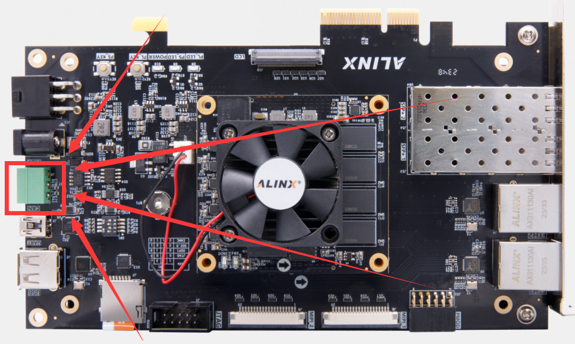
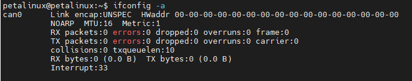
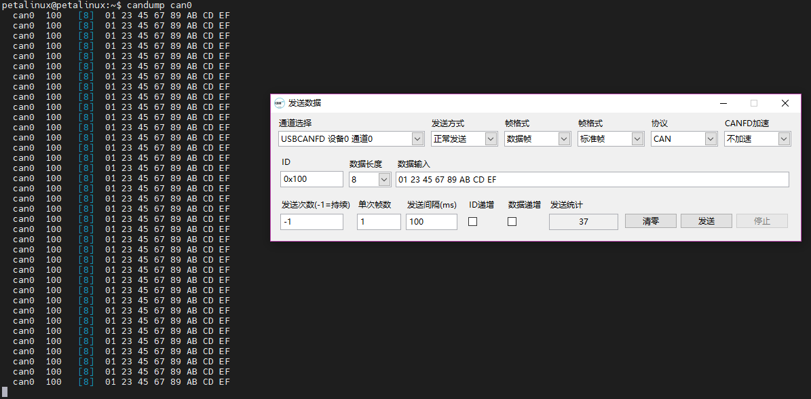
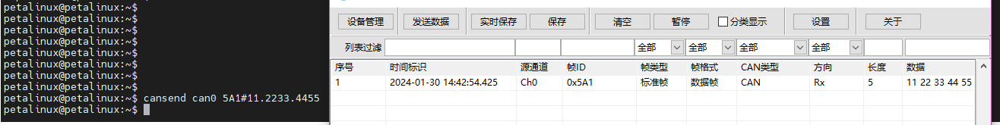

# CAN
## The position of CAN on VD100

## Using CAN in Linux
There is only one CAN interface on the VD100 development board. To test the CAN interface, you need to use a CAN to USB tool to connect to a PC for testing. \
Using the `ifconfig -a` command on the development board system, you can see that there is a can on the development board, namely *can0*:\
\
Use this command to set the bitrate of can0 and start can0:\
`sudo ip link set can0 up type can bitrate 1000000`\
\
Use this command to receive the data received by can0:\
`candump can0`\
At the same time, open the host computer of the CAN to USB tool, set it to the same baud rate, and send data. You can see that the development board system has received the data sent by the host computer: \

---
Use this command to send the hexadecimal data "11 22 33 44 55\" with the ID \"5A1\" to the CAN bus through can0:\
`cansend can0 5A1#11.2233.4455`\
This CAN message can also be received in our host computer program:

---
---
- Visit [ALINX official website](https://www.alinx.com) for more information.

