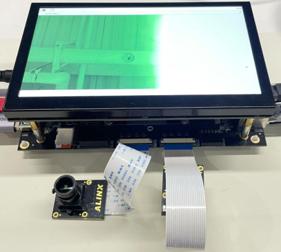
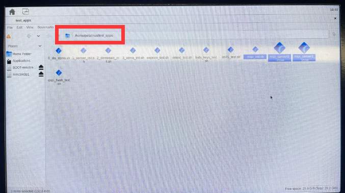
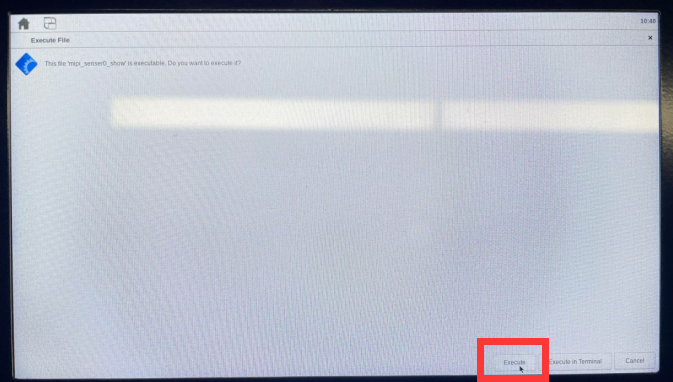

# mipicam
- The MIPI camera interface is at this location on the VD100 development board:

- After connecting the MIPI camera, the status is as follows:

---
## Display the MIPI camera in the development board Linux system
- STEP1: After the system starts and logs in, call the initialization script to initialize the IP related to the MIPI camera:\
`cd ~/test_apps/ && sudo ./mipi_init.sh && cd ~`

- STEP2: Run *sudo ~/test_apps/mipi_senser0_show* program to display MIPI1 camera\
 \

- STEP3: Run *sudo ~/test_apps/mipi_senser1_show* program to display MIPI2 camera\
 \

PS: *mipi_senserx_show* The program source code is [here](../../applications/qtProject/mipi_camera). Regarding how to use QTCreator to compile this program, please refer to [4_Install QT library and OPENCV library and set up the compilation environment in QTCreator.md] (./4_Install QT library and OPENCV library and set up the compilation environment in QTCreator.md)

---
### You can also use the mouse to run these programs on the MatchBox desktop.
- STEP1: Click the *File Manager PC...* icon: \

- Double-click the folder to enter the path where the program is located: \

- Double-click the program to run it. After the pop-up window, click the *Execute* button in the lower right corner of the computer: \

- Program execution: \

---
---
- Visit [ALINX official website](https://www.alinx.com) for more information.

