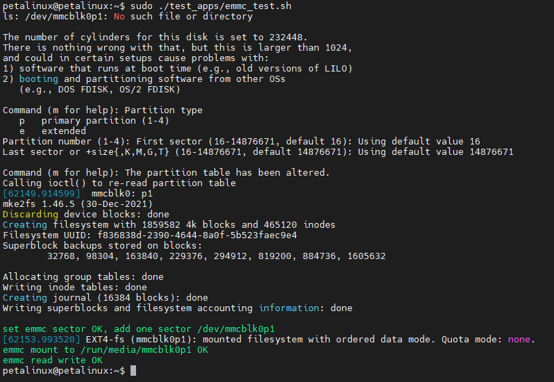

# EMMC
## Using EMMC on Linux system
The operating file of EMMC in Linux system is */dev/mmcblk0*. Using EMMC in Linux system requires setting, formatting and mounting partitions. For example:
```
#If a partition already exists, you need to unmount the partition first
sudo umount /dev/mmcblk0p1
#Delete a partition of /dev/mmcblk0 and create a new partition
echo "d

n
p
1


w
" | sudo fdisk /dev/mmcblk0
#Format the /dev/mmcblk0p1 partition into ext4 format
echo "y

" | sudo mkfs.ext4 /dev/mmcblk0p1
#Mount /dev/mmcblk0p1 to /media/sd-mmcblk0p1
sudo mkdir /media/sd-mmcblk0p1 && sudo mount /dev/mmcblk0p1 /media/sd-mmcblk0p1
```
After mounting, you can operate files in the mounted path, and these files will eventually be saved in EMMC.
## Use the system's built-in script to test EMMC
Run *sudo ~/test_apps/emmc_test.sh*: \


---
---
- Visit [ALINX official website](https://www.alinx.com) for more information.