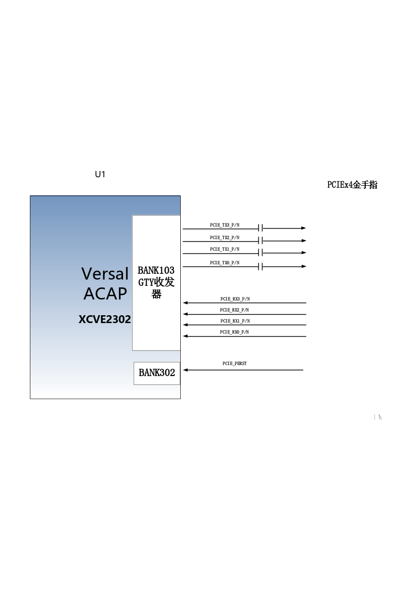
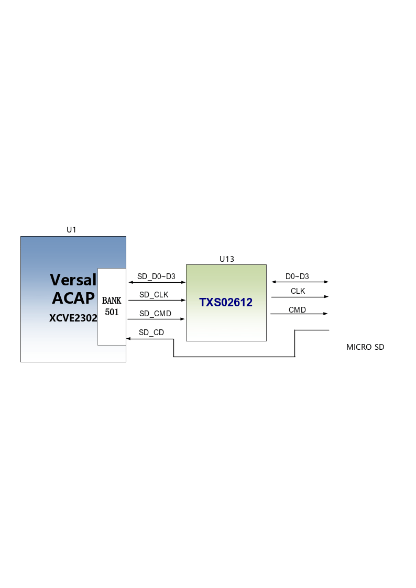
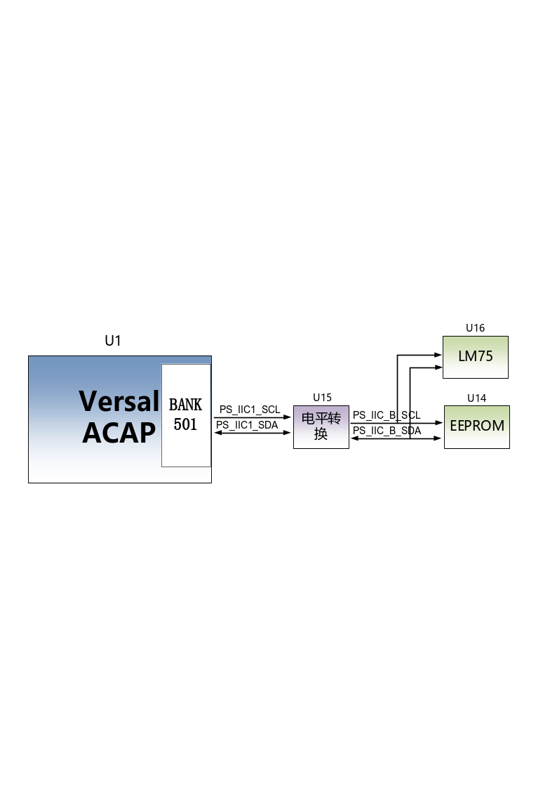
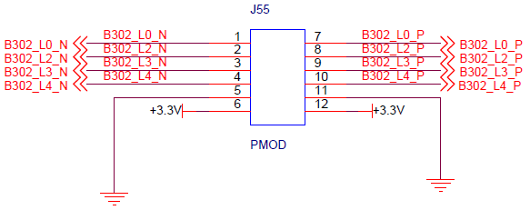
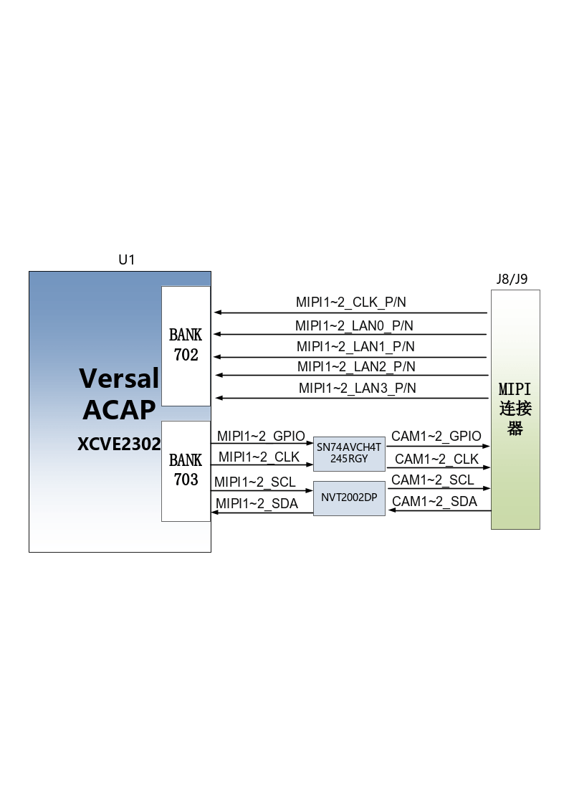

扩展板
======

.. _简介-1:

简介
----

通过前面的功能简介，我们可以了解到扩展板部分的功能

-  2路千兆以太网RJ-45接口

-  PCIe3.0 x4接口

-  2路SFP+高速光纤接口

-  1路USB Uart调试接口

-  1路USB HOST接口

-  1路LVDS显示屏接口

-  2路MIPI摄像头接口

-  1路Micro SD卡座

-  JTAG调试口

-  1路温度传感器

-  1路EEPROM

-  1路CANFD通信接口

-  1路22针拓展口

千兆以太网接口
--------------

VD100拓展板上有两路千兆以太网接口，1路连接到PS端，另1路连接到PL端。通过景略半导体的工业级以太网GPHY芯片（JL2121-N040I）为用户提供网络通信服务。JL2121芯片支持10/100/1000
Mbps网络传输速率，通过RGMII接口跟FPGA的MAC层进行数据通信。JL2121D支持ＭDI/MDX自适应，各种速度自适应，Master/Slave自适应，支持MDIO总线进行PHY的寄存器管理。

JL2121上电会检测一些特定的IO的电平状态，从而确定自己的工作模式。表3-2-1
描述了GPHY芯片上电之后的默认设定信息。

+-----------------+--------------------------+-------------------------+
| **配置Pin脚**   | **说明**                 | **配置值**              |
+-----------------+--------------------------+-------------------------+
| RXD3_ADR0       | MDIO/MDC 模式的PHY地址   | PHY Address 为 001      |
|                 |                          |                         |
| RXC_ADR1        |                          |                         |
|                 |                          |                         |
| RXCTL_ADR2      |                          |                         |
+-----------------+--------------------------+-------------------------+
| RXD1_TXDLY      | TX时钟2ns延时            | 延时                    |
+-----------------+--------------------------+-------------------------+
| RXD0_RXDLY      | RX时钟2ns延时            | 延时                    |
+-----------------+--------------------------+-------------------------+

表3-2-1 PHY芯片默认配置值

当网络连接到千兆以太网时，FPGA和PHY芯片JL2121的数据传输时通过RGMII总线通信，传输时钟为125Mhz，数据在时钟的上升沿和下降样采样。

当网络连接到百兆以太网时，FPGA和PHY芯片JL2121的数据传输时通过RMII总线通信，传输时钟为25Mhz。数据在时钟的上升沿和下降样采样。

千兆以太网的设计示意图如图3-2-1所示:

.. image:: images/media/image15.png

图3-2-1千兆以太网接口设计示意图

**千兆以太网引脚分配如下：**

+-----------------+----------------+----------+-----------------------+
| **信号名称**    | **引脚名**     | **引脚   | **备注**              |
|                 |                | 号**     |                       |
+-----------------+----------------+----------+-----------------------+
| PHY1_TXCK       | LPD_MIO0       | T1       | 以太网1RGMII 发送时钟 |
+-----------------+----------------+----------+-----------------------+
| PHY1_TXD0       | LPD_MIO1       | U1       | 以太网1发送数据bit０  |
+-----------------+----------------+----------+-----------------------+
| PHY1_TXD1       | LPD_MIO2       | W1       | 以太网1发送数据bit1   |
+-----------------+----------------+----------+-----------------------+
| PHY1_TXD2       | LPD_MIO3       | Y1       | 以太网1发送数据bit2   |
+-----------------+----------------+----------+-----------------------+
| PHY1_TXD3       | LPD_MIO4       | Y2       | 以太网1发送数据bit3   |
+-----------------+----------------+----------+-----------------------+
| PHY1_TXCTL      | LPD_MIO5       | W2       | 以太网1发送使能信号   |
+-----------------+----------------+----------+-----------------------+
| PHY1_RXCK       | LPD_MIO6       | V2       | 以太网1RGMII接收时钟  |
+-----------------+----------------+----------+-----------------------+
| PHY1_RXD0       | LPD_MIO7       | U2       | 以太网1接收数据Bit0   |
+-----------------+----------------+----------+-----------------------+
| PHY1_RXD1       | LPD_MIO8       | T3       | 以太网1接收数据Bit1   |
+-----------------+----------------+----------+-----------------------+
| PHY1_RXD2       | LPD_MIO9       | U3       | 以太网1接收数据Bit2   |
+-----------------+----------------+----------+-----------------------+
| PHY1_RXD3       | LPD_MIO10      | V3       | 以太网1接收数据Bit3   |
+-----------------+----------------+----------+-----------------------+
| PHY1_RXCTL      | LPD_MIO11      | Y3       | 以                    |
|                 |                |          | 太网1接收数据有效信号 |
+-----------------+----------------+----------+-----------------------+
| PHY1_MDIO       | PS_MIO51       | AA10     | 以太网1MDIO管理数据   |
+-----------------+----------------+----------+-----------------------+
| PHY1_MDC        | PS_MIO50       | AB10     | 以太网1MDIO管理时钟   |
+-----------------+----------------+----------+-----------------------+
| PHY1_RESET      | LPD_MIO15      | T5       | 以太网1复位信号       |
+-----------------+----------------+----------+-----------------------+
| PHY2_TXCK       | B302_L9_N      | A13      | 以太网2 RGMII         |
|                 |                |          | 发送时钟              |
+-----------------+----------------+----------+-----------------------+
| PHY2_TXD0       | B302_L8_N      | A11      | 以太网2发送数据bit０  |
+-----------------+----------------+----------+-----------------------+
| PHY2_TXD1       | B302_L8_P      | B11      | 以太网2发送数据bit1   |
+-----------------+----------------+----------+-----------------------+
| PHY2_TXD2       | B302_L7_N      | A10      | 以太网2发送数据bit2   |
+-----------------+----------------+----------+-----------------------+
| PHY2_TXD3       | B302_L7_P      | B10      | 以太网2发送数据bit3   |
+-----------------+----------------+----------+-----------------------+
| PHY2_TXCTL      | B302_L9_P      | B12      | 以太网2发送使能信号   |
+-----------------+----------------+----------+-----------------------+
| PHY2_RXCK       | B302_L6_P      | D10      | 以太网2 RGMII接收时钟 |
+-----------------+----------------+----------+-----------------------+
| PHY2_RXD0       | B302_L5_N      | C12      | 以太网2接收数据Bit0   |
+-----------------+----------------+----------+-----------------------+
| PHY2_RXD1       | B302_L5_P      | D11      | 以太网2接收数据Bit1   |
+-----------------+----------------+----------+-----------------------+
| PHY2_RXD2       | B302_L10_N     | A14      | 以太网2接收数据Bit2   |
+-----------------+----------------+----------+-----------------------+
| PHY2_RXD3       | B302_L10_P     | B13      | 以太网2接收数据Bit3   |
+-----------------+----------------+----------+-----------------------+
| PHY2_RXCTL      | B302_L6_N      | C10      | 以                    |
|                 |                |          | 太网2接收数据有效信号 |
+-----------------+----------------+----------+-----------------------+
| PHY2_MDIO       | B302_L1_P      | C14      | 以太网2 MDIO管理数据  |
+-----------------+----------------+----------+-----------------------+
| PHY2_MDC        | B302_L1_N      | C13      | 以太网2 MDIO管理时钟  |
+-----------------+----------------+----------+-----------------------+
| PHY2_RESET      | B703_L12_P     | H23      | 以太网2复位信号       |
+-----------------+----------------+----------+-----------------------+

PCIe3.0 X4接口
--------------

VD100扩展板上提供一个工业级高速数据传输PCIe3.0
x4接口，PCIE卡的外形尺寸符合标准PCIe卡电气规范要求，可直接在普通PC的x4
PCIe插槽上使用。

PCIe接口的收发信号直接跟FPGA的GTY收发器相连接，四通道的TX信号和RX信号都是以差分信号方式连接到FPGA，单通道通信速率可高达8G
bit带宽。PCIe的参考时钟由PC的PCIe插槽提供给开发板，参考时钟频率为100Mhz。

开发板的PCIe接口的设计示意图如下图3-3-1所示,其中TX发送信号和参考时钟CLK信号用AC耦合模式连接。

图3-3-1 PCIe x4设计示意图

   **PCIe x4接口FPGA引脚分配如下：**

+------------------+----------------+---------------------------------+
| **网络名称**     | **FPGA引脚**   | **备注**                        |
+------------------+----------------+---------------------------------+
| PCIE_RX0_P       | P2             | PCIE通道0数据接收 Positive      |
+------------------+----------------+---------------------------------+
| PCIE_RX0_N       | P1             | PCIE通道0数据接收Negative       |
+------------------+----------------+---------------------------------+
| PCIE_RX1_P       | M2             | PCIE通道1数据接收 Positive      |
+------------------+----------------+---------------------------------+
| PCIE_RX1_N       | M1             | PCIE通道1数据接收Negative       |
+------------------+----------------+---------------------------------+
| PCIE_RX2_P       | K2             | PCIE通道2数据接收 Positive      |
+------------------+----------------+---------------------------------+
| PCIE_RX2_N       | K1             | PCIE通道2数据接收Negative       |
+------------------+----------------+---------------------------------+
| PCIE_RX3_P       | H2             | PCIE通道3数据接收 Positive      |
+------------------+----------------+---------------------------------+
| PCIE_RX3_N       | H1             | PCIE通道3数据接收Negative       |
+------------------+----------------+---------------------------------+
| PCIE_TX0_P       | N5             | PCIE通道0数据发送 Positive      |
+------------------+----------------+---------------------------------+
| PCIE_TX0_N       | N4             | PCIE通道0数据发送Negative       |
+------------------+----------------+---------------------------------+
| PCIE_TX1_P       | L5             | PCIE通道1数据发送 Positive      |
+------------------+----------------+---------------------------------+
| PCIE_TX1_N       | L4             | PCIE通道1数据发送Negative       |
+------------------+----------------+---------------------------------+
| PCIE_TX2_P       | J5             | PCIE通道2数据发送 Positive      |
+------------------+----------------+---------------------------------+
| PCIE_TX2_N       | J4             | PCIE通道2数据发送Negative       |
+------------------+----------------+---------------------------------+
| PCIE_TX3_P       | G5             | PCIE通道3数据发送 Positive      |
+------------------+----------------+---------------------------------+
| PCIE_TX3_N       | G4             | PCIE通道3数据发送Negative       |
+------------------+----------------+---------------------------------+
| PCIE_CLK_P       | M7             | PCIE的参考时钟 Positive         |
+------------------+----------------+---------------------------------+
| PCIE_CLK_N       | M6             | PCIE的参考时钟Negative          |
+------------------+----------------+---------------------------------+
| PCIE_PERST       | B13            | PCIE复位信号                    |
+------------------+----------------+---------------------------------+

光纤接口
--------

VD100开发板上有2路SFP+光纤接口，用户可以购买SFP光模块(市场上1.25G，2.5G，10G光模块）插入到这2个光纤接口中进行光纤数据通信。2路光纤接口分别跟FPGA的BANK104的GTY收发器的2路RX/TX相连接，TX信号和RX信号都是以差分信号方式通过隔直电容连接FPGA和光模块，每路TX发送和RX接收数据速率高达10Gb/s。BANK104的GTY收发器的参考时钟由是156.25Mhz差分晶振提供。

FPGA和SFP光纤设计示意图如下图3-4-1所示:

.. image:: images/media/image17.png

图3-4-1光纤设计示意图

   **第1路光纤接口FPGA引脚分配如下：**

+------------------+----------------+---------------------------------+
| **网络名称**     | **FPGA引脚**   | **备注**                        |
+------------------+----------------+---------------------------------+
| SFP1_TX_P        | E5             | SFP光模块数据发送 Positive      |
+------------------+----------------+---------------------------------+
| SFP1_TX_N        | E4             | SFP光模块数据发送Negative       |
+------------------+----------------+---------------------------------+
| SFP1_RX_P        | F2             | SFP光模块数据接收 Positive      |
+------------------+----------------+---------------------------------+
| SFP1_RX_N        | F1             | SFP光模块数据接收Negative       |
+------------------+----------------+---------------------------------+
| SFP1_TX_DIS      | D26            | SFP光模块光发射禁止，低有效     |
+------------------+----------------+---------------------------------+
| SFP1_SCL         | D21            | I2C时钟信号                     |
+------------------+----------------+---------------------------------+
| SFP1_SDA         | D20            | I2C数据信号                     |
+------------------+----------------+---------------------------------+

..

   **第2路光纤接口FPGA引脚分配如下：**

+------------------+----------------+---------------------------------+
| **网络名称**     | **FPGA引脚**   | **备注**                        |
+------------------+----------------+---------------------------------+
| SFP2_TX_P        | D8             | SFP光模块数据发送 Positive      |
+------------------+----------------+---------------------------------+
| SFP2_TX_N        | D7             | SFP光模块数据发送Negative       |
+------------------+----------------+---------------------------------+
| SFP2_RX_P        | D2             | SFP光模块数据接收 Positive      |
+------------------+----------------+---------------------------------+
| SFP2_RX_N        | D1             | SFP光模块数据接收Negative       |
+------------------+----------------+---------------------------------+
| SFP2_TX_DIS      | D25            | SFP光模块光发射禁止，低有效     |
+------------------+----------------+---------------------------------+
| SFP_CLK_N        | H6             | FPGA输入时钟Negative            |
+------------------+----------------+---------------------------------+
| SFP_CLK_P        | H7             | FPGA输入时钟Positive            |
+------------------+----------------+---------------------------------+

USB转串口
---------

VD100扩展板上配备了1个连接到PS端的Uart转USB接口。转换芯片采用了Silicon
Labs CP2102GM的USB-UAR芯片, USB接口采用MINI
USB接口，可以用一根USB线将它连接到上PC的USB口进行串口数据通信 。

USB Uart电路设计的示意图如图3-5-1所示\ |image2| 

图3-5-1 USB转串口示意图

**UART转串口的FPGA引脚分配：**

+---------------+---------------------+-------------+----------------+
| **信号名称**  | **FPGA引脚名**      | **F         | **备注**       |
|               |                     | PGA引脚号** |                |
+---------------+---------------------+-------------+----------------+
| PS_UART0_RX   | LPD_MIO16           | U5          | Uart数据输入   |
+---------------+---------------------+-------------+----------------+
| PS_UART0_TX   | LPD_MIO17           | V5          | Uart数据输出   |
+---------------+---------------------+-------------+----------------+

USB2.0接口
----------

VD100扩展板上有1个USB2.0接口，支持HOST工作模式。USB2.0通过ULPI接口连接外部的USB3320C芯片，实现高速USB2.0的数据通信。

USB接口为扁型USB接口(USB Type A)，方便用户同时连接不同的USB
Slave外设(比如USB鼠标，键盘或U盘）。USB2.0连接的示意图如3-6-1所示：

.. image:: images/media/image19.png

3-6-1 USB3.0接口示意图

**USB接口引脚分配：**

+---------------+--------------+------------+-------------------------+
| 信号名称      | 引脚名       | 引脚号     | 备注                    |
+---------------+--------------+------------+-------------------------+
| USB_DATA0     | PS_MIO14     | AC3        | USB2.0数据Bit0          |
+---------------+--------------+------------+-------------------------+
| USB_DATA1     | PS_MIO15     | AE3        | USB2.0数据Bit1          |
+---------------+--------------+------------+-------------------------+
| USB_DATA2     | PS_MIO16     | AF3        | USB2.0数据Bit2          |
+---------------+--------------+------------+-------------------------+
| USB_DATA3     | PS_MIO17     | AG3        | USB2.0数据Bit3          |
+---------------+--------------+------------+-------------------------+
| USB_DATA4     | PS_MIO19     | AH4        | USB2.0数据Bit4          |
+---------------+--------------+------------+-------------------------+
| USB_DATA5     | PS_MIO20     | AF4        | USB2.0数据Bit5          |
+---------------+--------------+------------+-------------------------+
| USB_DATA6     | PS_MIO21     | AE4        | USB2.0数据Bit6          |
+---------------+--------------+------------+-------------------------+
| USB_DATA7     | PS_MIO22     | AD4        | USB2.0数据Bit7          |
+---------------+--------------+------------+-------------------------+
| USB_STP       | PS_MIO24     | AA4        | USB2.0停止信号          |
+---------------+--------------+------------+-------------------------+
| USB_DIR       | PS_MIO23     | AC4        | USB2.0数据方向信号      |
+---------------+--------------+------------+-------------------------+
| USB_CLK       | PS_MIO18     | AH3        | USB2.0时钟信号          |
+---------------+--------------+------------+-------------------------+
| USB_NXT       | PS_MIO25     | Y4         | USB2.0下一数据信号      |
+---------------+--------------+------------+-------------------------+
| USB_RESET_N   | PS_MIO13     | AB3        | USB2.0复位信号          |
+---------------+--------------+------------+-------------------------+

LVDS显示屏接口
--------------

扩展板上包含了一个LVDS显示屏接口，可以用来接我们的7寸显示屏模块（AN7000）。LVDS接口是40PIN的FPC连接器，有4对LVDS的数据和1对时钟，以及其它的控制信号通过电平转换芯片连接到BANK703的差分IO管脚上，电平标准为1.5V。\ |image3|\ 

图3-7-1LVDS接口设计原理图

LVDS\ **接口引脚分配**

+--------------------+-------------+----------+-----------------------+
| **信号名称**       | **引脚名**  | **引脚   | **备注**              |
|                    |             | 号**     |                       |
+--------------------+-------------+----------+-----------------------+
| LVDS_CLK-          | B703_L17_N  | A24      | LVDS屏输入时钟负      |
+--------------------+-------------+----------+-----------------------+
| LVDS_CLK+          | B703_L17_P  | A23      | LVDS屏输入时钟正      |
+--------------------+-------------+----------+-----------------------+
| LVDS_D0-           | B703_L13_N  | G23      | LV                    |
|                    |             |          | DS屏输入的数据DATA0负 |
+--------------------+-------------+----------+-----------------------+
| LVDS_D0+           | B703_L13_P  | F22      | LV                    |
|                    |             |          | DS屏输入的数据DATA0正 |
+--------------------+-------------+----------+-----------------------+
| LVDS_D1-           | B703_L22_N  | A21      | LV                    |
|                    |             |          | DS屏输入的数据DATA1负 |
+--------------------+-------------+----------+-----------------------+
| LVDS_D1+           | B703_L22_P  | A20      | LV                    |
|                    |             |          | DS屏输入的数据DATA1正 |
+--------------------+-------------+----------+-----------------------+
| LVDS_D2-           | B703_L23_N  | B22      | LV                    |
|                    |             |          | DS屏输入的数据DATA2负 |
+--------------------+-------------+----------+-----------------------+
| LVDS_D2+           | B703_L23_P  | C22      | LV                    |
|                    |             |          | DS屏输入的数据DATA2正 |
+--------------------+-------------+----------+-----------------------+
| LVDS_D3-           | B703_L10_N  | A26      | LV                    |
|                    |             |          | DS屏输入的数据DATA3负 |
+--------------------+-------------+----------+-----------------------+
| LVDS_D3+           | B703_L10_P  | A25      | LV                    |
|                    |             |          | DS屏输入的数据DATA3正 |
+--------------------+-------------+----------+-----------------------+
| FPGA_LCD_SDI       | B703_L11_N  | B27      | LCD屏串行             |
|                    |             |          | 接口地址和SPI数据输入 |
+--------------------+-------------+----------+-----------------------+
| FPGA_LCD_CSB       | B703_L11_P  | B26      | LCD屏串               |
|                    |             |          | 行接口芯片SPl片选信号 |
+--------------------+-------------+----------+-----------------------+
| FPGA_LCD_SCL       | B703_L3_N   | E28      | LCD屏串行接口SPI时钟  |
+--------------------+-------------+----------+-----------------------+
| FPGA_LCD_SDO       | B703_L9_N   | B25      | LCD                   |
|                    |             |          | 屏串行接口SPI数据输出 |
+--------------------+-------------+----------+-----------------------+
| FPGA_LCD_RESET     | B703_L3_P   | E27      | LCD屏复位信号         |
+--------------------+-------------+----------+-----------------------+
| FPGA_LCD_STBYB     | B703_L25_N  | F25      | LCD屏模式设置信号     |
+--------------------+-------------+----------+-----------------------+
| FPGA_BANKLCD_SDA   | B703_L12_N  | H24      | 背光I2C数据           |
+--------------------+-------------+----------+-----------------------+
| FPGA_BANKLCD_SCL   | B703_L14_P  | E22      | 背光I2C时钟           |
+--------------------+-------------+----------+-----------------------+
| FPGA_BANKLCD_INT   | B703_L9_P   | C25      | 背光故障中断信号      |
+--------------------+-------------+----------+-----------------------+
| FPGA_BANKLCD_EN    | B703_L25_P  | E24      | 背光使能信号          |
+--------------------+-------------+----------+-----------------------+
| FPGA_BANKLCD_PWM   | B703_L15_N  | C24      | 背光亮度调节信号      |
+--------------------+-------------+----------+-----------------------+
| FPGA_BANKLCD_SYNC  | B703_L15_P  | D24      | 背光同步升压输入      |
+--------------------+-------------+----------+-----------------------+
| LVDS_CLK_N         | B703_L24_N  | F24      | FPGA输入时钟负        |
+--------------------+-------------+----------+-----------------------+
| LVDS_CLK_P         | B703_L24_P  | F23      | FPGA输入时钟正        |
+--------------------+-------------+----------+-----------------------+

MIPI接口
--------

VD100扩展板上包含了2个MIPI 4 Lane摄像头接口，可以用来接我们的MIPI
OS05A10像头模块（AN5010）。MIPI接口是20PIN的FPC连接器，为4个LANE的数据和1对时钟，连接到BANK702的差分IO管脚上，电平标准为1.2V；其它的控制信号通过电平转换连接到BANK703的IO上，电平标准为1.5V。

|image4| 

图3-8-1 MIPI接口设计原理图

**MIPI接口引脚分配**

+---------------+--------------+------------+------------------------+
| **信号名称**  | **引脚名**   | **引脚号** | **备注**               |
+---------------+--------------+------------+------------------------+
| MIPI1_CLK_N   | B702_L12_N   | T24        | MIPI1输入时钟负        |
+---------------+--------------+------------+------------------------+
| MIPI1_CLK_P   | B702_L12_P   | U23        | MIPI1输入时钟正        |
+---------------+--------------+------------+------------------------+
| MIPI1_LAN0_N  | B702_L13_N   | R24        | MIPI1输入的数据LANE0负 |
+---------------+--------------+------------+------------------------+
| MIPI1_LAN0_P  | B702_L13_P   | T23        | MIPI1输入的数据LANE0正 |
+---------------+--------------+------------+------------------------+
| MIPI1_LAN1_N  | B702_L14_N   | P24        | MIPI1输入的数据LANE1负 |
+---------------+--------------+------------+------------------------+
| MIPI1_LAN1_P  | B702_L14_P   | R23        | MIPI1输入的数据LANE1正 |
+---------------+--------------+------------+------------------------+
| MIPI1_LAN2_N  | B702_L16_N   | K24        | MIPI1输入的数据LANE2负 |
+---------------+--------------+------------+------------------------+
| MIPI1_LAN2_P  | B702_L16_P   | L23        | MIPI1输入的数据LANE2正 |
+---------------+--------------+------------+------------------------+
| MIPI1_LAN3_N  | B702_L15_N   | M23        | MIPI1输入的数据LANE3负 |
+---------------+--------------+------------+------------------------+
| MIPI1_LAN3_P  | B702_L15_P   | M22        | MIPI1输入的数据LANE3正 |
+---------------+--------------+------------+------------------------+
| MIPI1_SDA     | B703_L2_N    | F28        | MIPI1摄像头的I2C数据   |
+---------------+--------------+------------+------------------------+
| MIPI1_SCL     | B703_L2_P    | G27        | MIPI1摄像头的I2C时钟   |
+---------------+--------------+------------+------------------------+
| MIPI1_GPIO    | B703_L7_N    | G26        | MIPI1摄像头的GPIO控制  |
+---------------+--------------+------------+------------------------+
| MIPI1_CLK     | B703_L7_P    | G25        | MIPI1摄像头的时钟输入  |
+---------------+--------------+------------+------------------------+
| MIPI2_CLK_N   | B702_L18_N   | U22        | MIPI2输入时钟负        |
+---------------+--------------+------------+------------------------+
| MIPI2_CLK_P   | B702_L18_P   | V21        | MIPI2输入时钟正        |
+---------------+--------------+------------+------------------------+
| MIPI2_LAN0_N  | B702_L19_N   | R22        | MIPI2输入的数据LANE0负 |
+---------------+--------------+------------+------------------------+
| MIPI2_LAN0_P  | B702_L19_P   | T21        | MIPI2输入的数据LANE0正 |
+---------------+--------------+------------+------------------------+
| MIPI2_LAN1_N  | B702_L20_N   | P22        | MIPI2输入的数据LANE1负 |
+---------------+--------------+------------+------------------------+
| MIPI2_LAN1_P  | B702_L20_P   | R21        | MIPI2输入的数据LANE1正 |
+---------------+--------------+------------+------------------------+
| MIPI2_LAN2_N  | B702_L21_N   | M21        | MIPI2输入的数据LANE2负 |
+---------------+--------------+------------+------------------------+
| MIPI2_LAN2_P  | B702_L21_P   | N21        | MIPI2输入的数据LANE2正 |
+---------------+--------------+------------+------------------------+
| MIPI2_LAN3_N  | B702_L22_N   | L22        | MIPI2输入的数据LANE3负 |
+---------------+--------------+------------+------------------------+
| MIPI2_LAN3_P  | B702_L22_P   | K21        | MIPI2输入的数据LANE3正 |
+---------------+--------------+------------+------------------------+
| MIPI2_SDA     | B703_L4_N    | C28        | MIPI2摄像头的I2C数据   |
+---------------+--------------+------------+------------------------+
| MIPI2_SCL     | B703_L4_P    | D27        | MIPI2摄像头的I2C时钟   |
+---------------+--------------+------------+------------------------+
| MIPI2_GPIO    | B703_L0_N    | H28        | MIPI2摄像头的GPIO控制  |
+---------------+--------------+------------+------------------------+
| MIPI2_CLK     | B703_L0_P    | J27        | MIPI2摄像头的时钟输入  |
+---------------+--------------+------------+------------------------+

SD卡
----

VD100扩展板包含了一个Micro型的SD卡接口，以提供用户访问SD卡存储器，用于存储XCVE2302芯片的BOOT程序，Linux操作系统内核,
文件系统以及其它的用户数据文件。

SDIO信号与XCVE2302的PS
BANK501的IO信号相连，因为501的VCCIO设置为1.8V，但SD卡的数据电平为3.3V,
我们这里通过TXS02612电平转换器来连接。XCVE2302
PS和SD卡连接器的原理图如图3-9-1所示。

  
图3-9-1 SD卡连接示意图

**SD卡槽引脚分配**

+---------------+--------------+------------+-------------------------+
| **信号名称**  | **引脚名**   | **引脚号** | **备注**                |
+---------------+--------------+------------+-------------------------+
| SD_CLK        | PS_MIO26     | AA5        | SD时钟信号              |
+---------------+--------------+------------+-------------------------+
| SD_CD         | PS_MIO28     | AC5        | SD卡检测信号            |
+---------------+--------------+------------+-------------------------+
| SD_CMD        | PS_MIO29     | AD5        | SD命令信号              |
+---------------+--------------+------------+-------------------------+
| SD_D0         | PS_MIO30     | AE6        | SD数据Data0             |
+---------------+--------------+------------+-------------------------+
| SD_D1         | PS_MIO31     | AD6        | SD数据Data1             |
+---------------+--------------+------------+-------------------------+
| SD_D2         | PS_MIO32     | AB6        | SD数据Data2             |
+---------------+--------------+------------+-------------------------+
| SD_D3         | PS_MIO33     | AA6        | SD数据Data3             |
+---------------+--------------+------------+-------------------------+

EEPROM 24LC04和温度传感器
-------------------------

VD100开发板板载了一片EEPROM，型号为24LC04,容量为：4Kbit（2*256*8bit），通过IIC总线连接到PS端进行通信。另外板上还带有一个高精度、低功耗、数字温度传感器芯片，型号为ON
Semiconductor公司的LM75，LM75芯片的温度精度为0.5度。EEPROM和温度传感器通过I2C总线挂载到Versal
ACAP的Bank501 MIO上。图3-10-1为EEPROM和温度传感器的原理图

  
图3-10-1 EEPROM和传感器的原理图

**EEPROM通信引脚分配如下：**

+-----------------+----------------+----------------+----------------+
| 信号名称        | 引脚名         | 引脚号         | 备注           |
+-----------------+----------------+----------------+----------------+
| PS_IIC1_SCL     | PS_MIO34       | AB7            | I2C时钟信号    |
+-----------------+----------------+----------------+----------------+
| PS_IIC1_SDA     | PS_MIO35       | AC7            | I2C数据信号    |
+-----------------+----------------+----------------+----------------+

JTAG接口
--------

开发板预留了一个JTAG接口，用于下载FPGA程序或者固化程序到FLASH。为了带电插拔造成对FPGA芯片的损坏，我们在JTAG信号上添加了保护二极管来保证信号的电压在FPGA接受的范围，避免FPGA的损坏。

.. image:: images/media/image24.png
  
图3-8-1 JTAG接口原理图

JTAG线插拔的时候注意不要热插拔。

CANFD通信接口
-------------

VD100扩展板上有1路CAN/CANFD通信接口，连接在PS系统端BANK502的MIO接口上。CANFD收发芯片选用了智恩浦公司的TJA1051T/3/1J芯片为用户CAN通信服务。

图3-12-1为PS端CAN收发芯片的连接示意图

  
图3-12-1 PS端CAN收发芯片的连接示意图

**CAN通信引脚分配如下：**

+------------------+----------------+----------------+-----------------+
| **信号名称**     | **引脚名**     | **引脚号**     | **备注**        |
+------------------+----------------+----------------+-----------------+
| CANFD_TXD1       | LPD_MIO23      | Y7             | CAN1 发送端     |
+------------------+----------------+----------------+-----------------+
| CANFD_RXD1       | LPD_MIO22      | T6             | CAN1 接收端     |
+------------------+----------------+----------------+-----------------+

PMOD拓展口
----------

扩展板预留1个12PIN
2.54mm标准间距的PMOD的扩展口J55，用于连接外部模块或者设备，扩展口有3.3V电源2路，地2路，IO口8路。IO的电平标准为3.3V，\ **切勿跟5V设备的IO直接连接，以免烧坏FPGA。如果要接5V设备的IO，需要接电平转换芯片。**

扩展口(55)的电路如下图3-13-1所示

  
图3-13-1扩展口J55原理图

**J55扩展口FPGA的引脚分配**

+----------+-------------+------------+----------+------------+------------+
| **J55引  | **FPGA**    | **FPGA**   | **J55引  | **FPGA**   | **FPGA**   |
| 脚编号** | **引脚名**  | **引脚号** | 脚编号** | **引脚名** | **引脚名** |
+----------+-------------+------------+----------+------------+------------+
| 1        | B302_L0_N   | E14        | 7        | B          | F14        |
|          |             |            |          | 302_L0_P   |            |
+----------+-------------+------------+----------+------------+------------+
| 2        | B302_L2_N   | D14        | 8        | B          | E13        |
|          |             |            |          | 302_L2_P   |            |
+----------+-------------+------------+----------+------------+------------+
| 3        | B302_L3_N   | D12        | 9        | B          | E12        |
|          |             |            |          | 302_L3_P   |            |
+----------+-------------+------------+----------+------------+------------+
| J4       | B302_L4_N   | E11        | 10       | B          | F11        |
|          |             |            |          | 302_L4_P   |            |
+----------+-------------+------------+----------+------------+------------+
| 5        | GND         | -          | 11       | GND        | -          |
+----------+-------------+------------+----------+------------+------------+
| 6        | +3.3V       | -          | 12       | +3.3V      | -          |
+----------+-------------+------------+----------+------------+------------+

按键
----

扩展板上含有2个用户按键KEY1~KEY2，两个按键都连接到FPGA的普通的IO上，一个连接到PL端，另一个连接到PS端。按键低电平有效，当按键按下，FPGA的IO输入电压为低，当没有按键按下时，FPGA的IO输入电压为高。按键部分电路如下图3-10-1所示

.. image:: images/media/image27.png
  
图3-14-1按键硬件设计示意图

**按键FPGA引脚分配：**

+--------------+------------------+------------+----------------------+
| **信号名称** | **FPGA引脚名**   | **FP       | **备注**             |
|              |                  | GA引脚号** |                      |
+--------------+------------------+------------+----------------------+
| PS_LED1      | LPD_MIO25        | Y9         | 用户按键1            |
+--------------+------------------+------------+----------------------+
| PL_KEY1      | B703_L19_N       | F21        | 用户按键2            |
+--------------+------------------+------------+----------------------+

.. _led灯-1:

LED灯
-----

扩展板上有3个红色LED灯，其中1个是电源指示灯(PWR)，2个是用户LED灯（LED1~LED2）。当开发板供电后，电源指示灯会亮起。用户LED1~LED2连接到FPGA的普通IO，一个连接到PL端，另一个连接到PS端，当连接用户LED灯的IO电压配置为高电平时，用户LED灯点亮，当连接IO电压为配置为低电平时，用户LED会被熄灭。LED灯硬件连接的原理图如图3-11-1所示

.. image:: images/media/image28.png
  
图3-15-1 LED灯硬件设计原理图

**LED FPGA引脚分配：**

+--------------+-------------------+---------------+-------------------+
| **信号名称** | **FPGA引脚名**    | **FPGA引脚号**| **备注**          |
+--------------+-------------------+---------------+-------------------+
| PS_LED1      | LPD_MIO25         | Y9            | 用户定义指示灯    |
+--------------+-------------------+---------------+-------------------+
| PL_LED1      | B703_L19_P        | E20           | 用户定义指示灯    |
+--------------+-------------------+---------------+-------------------+

供电电源
--------

开发板的电源输入电压为DC12V，请使用开发板自带的电源,不要用其他规格的电源，以免损坏开发板。扩展板上通过3路DC/DC电源芯片ETA1471FT2G转化成+5V，+3.3V，+1.8V三路电源，再通过LDO电源芯片SPX3819M5-1-5将+3.3V转化为+1.5V。另外扩展板上的+12V电源通过板间连接器给核心板供电，扩展上的电源设计如下图3-12-1所示

.. image:: images/media/image29.png
  
图3-16-1扩展板电源原理图

结构尺寸图
----------

.. image:: images/media/image30.png
  
正面图（Top View）

.. |image2| image:: images/media/image18.png
.. |image3| image:: images/media/image20.png

