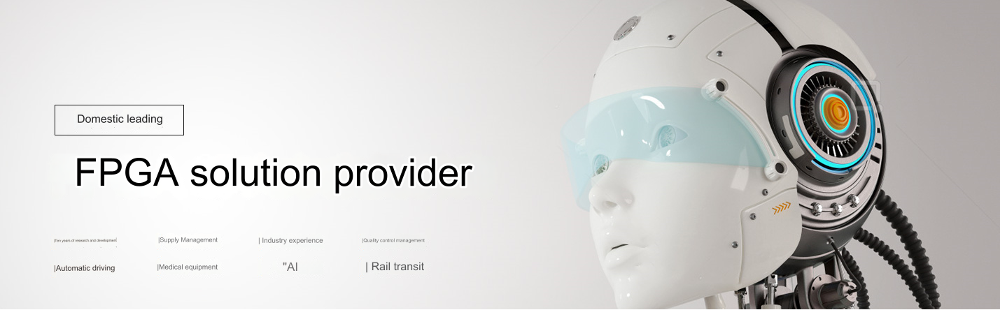

=============
About ALINX
=============

Xinyi Electronic Technology (Shanghai) Co., Ltd. was established in 2012 and is headquartered in Lingang Science and Technology City, Songjiang, Shanghai. It is a vehicle-mounted intelligent product and FPGA technology solution company. It has two major brands: "AUMO" and "ALINX", among which the AUMO brand Focusing on vehicle-mounted intelligent products, the ALINX brand focuses on FPGA products and solution customization. After ten years of development, the company's products have been exported to more than 30 countries overseas.

- In 2018, the company passed the high-tech enterprise certification and passed the ISO9001 quality system certification;
- In 2019, won the "Technology Innovation Award" from Jiuting Town, Songjiang District, Shanghai;
- In 2020, won the title of "Specialized, Specialized and New Enterprise" in Shanghai;
- In 2021, applied for the Shanghai Technology Innovation Funding Project for Small and Medium-sized Technology Enterprises, passed the certification of national-level technology-based small and medium-sized enterprises, and passed the high-tech enterprise certification review;
- In 2022, obtain special development funds for Shanghai Zhangjiang National Independent Innovation Demonstration Zone and pass the "Shanghai Innovative Small and Medium-sized Enterprises" certification;

ALINX is the official partner of XILINX, the world's leading FPGA chip company, and the official partner of Unisoc, the leading domestic FPGA chip company. At the same time, as a Baidu AI partner, it has customized the Edgeboard series edge devices of the domestic AI flying paddle system for Baidu. . Through years of R&D investment, more than 100 FPGA SoM modules and supporting boards have been launched, accumulating more than 1,000 corporate batch users and tens of thousands of independent developers, with a far leading market share.

Through the business model of products + customized services, ALINX will continue to increase investment in product research and development and technology research, continue to cooperate with customers in vertical industries, focus on the field of high-end equipment, and assist customers in solving technical problems in the industry.

Contact information
=====================

- Official website: http://www.alinx.com
- Technical support: support@alinx.com
- Service hotline: 021-67676997
- Company address: 3rd Floor, Building 1, No. 1, Caosong Road, Xinqiao Town, Songjiang District, Shanghai
- Official flagship store: http://alinx.jd.com