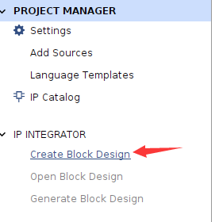
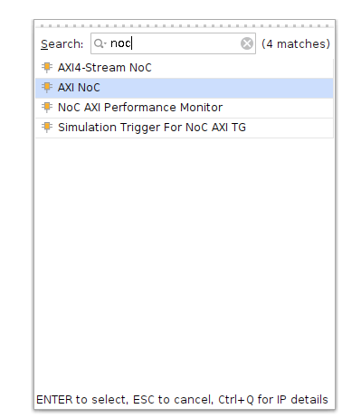
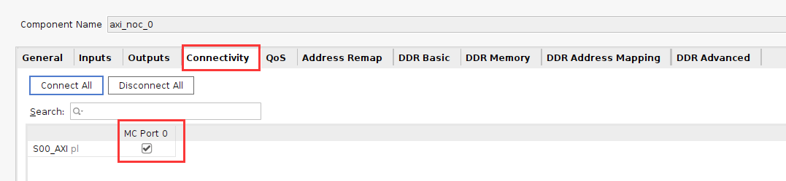
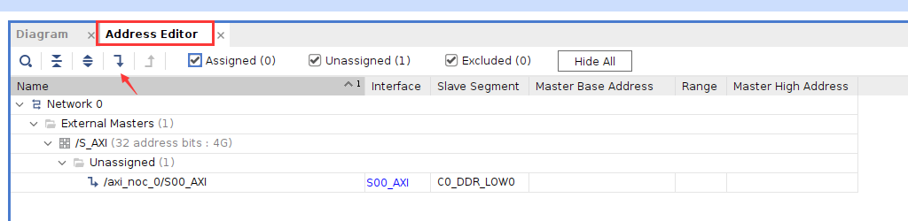

Chapter 3 PL reads and writes DDR4 experiment through NoC
==========================================================

**The experimental VIvado project is "pl_rw_ddr".**

Hardware introduction
-----------------------

The PL side of the development board has 4 16bit ddr4

.. image:: images/media/image87.png

Vivado project set up
-----------------------

Versal's DDR4 is accessed through NoC, so NoC IP needs to be added for configuration.

Create a Block design and configure the NoC
~~~~~~~~~~~~~~~~~~~~~~~~~~~~~~~~~~~~~~~~~~~~~~

1) Select Create Block Design

.. image:: images/media/image88.png

2) Add CIPS

.. image:: images/media/image56.png

.. image:: images/media/image57.png

3) Double-click CIPS, select PL_Subsystem, only the logic on the PL side

4) Add NoC IP

5) Configure NoC

Select an AXI Slave and AXI Clock, select "Single Memory Controller"

.. image:: images/media/image90.png

Select Inputs as PL

connection port

DDR4 configuration

.. image:: images/media/image94.png

Configuration is complete, click OK

6) Configure CIPS and add reset

.. image:: images/media/image96.png

Click Finish

7) Add Clocking Wizard and configure the output clock to 150MHz as the PL side read and write clock

.. image:: images/media/image99.png

8) Add IBUFDS for NoC and Clocking
Wizard provides a reference clock and exports S00_AXI, CH0_DDR4_0 and other buses, and adds axi_clk and axi_resetn to provide clock and reset for the PL side.

.. image:: images/media/image101.png

Double-click the reference clock pin and configure the frequency to 200MHz

.. image:: images/media/image102.png

Double-click the AXI bus and configure

.. image:: images/media/image103.png

.. image:: images/media/image104.png

9) Assign address

10) Create HDL

.. image:: images/media/image107.png

Add additional test code
~~~~~~~~~~~~~~~~~~~~~~~~~~~~~

The main function of other codes is to read and write ddr4 and compare whether the data is consistent. I will not introduce it in detail here. You can refer to the engineering code.

1) Add mark_debug debugging in mem_test.v

2) Pin binding

3) Comprehensive

.. image:: images/media/image111.png

3. After the synthesis is completed, click Set up debug

.. image:: images/media/image112.png

.. image:: images/media/image113.png

Set the number of sampling points according to needs

.. image:: images/media/image115.png

.. image:: images/media/image116.png

Then save and generate pdi file

.. image:: images/media/image51.png

Download debugging
--------------------

After generating the pdi file, use JTAG to download it to the development board, and DDR4 calibration and other information will be displayed in the MIG_1 window.

.. image:: images/media/image117.png

Debug signals can be viewed in hw_ila_1

.. image:: images/media/image118.png

.. _Experiment Summary-1:

Experiment summary
-----------------------

This experiment directly reads and writes ddr4 through the PL side Verilog code. It mainly understands the configuration method of NoC and how to access DDR4 through NoC. This configuration will be used in subsequent experiments.
