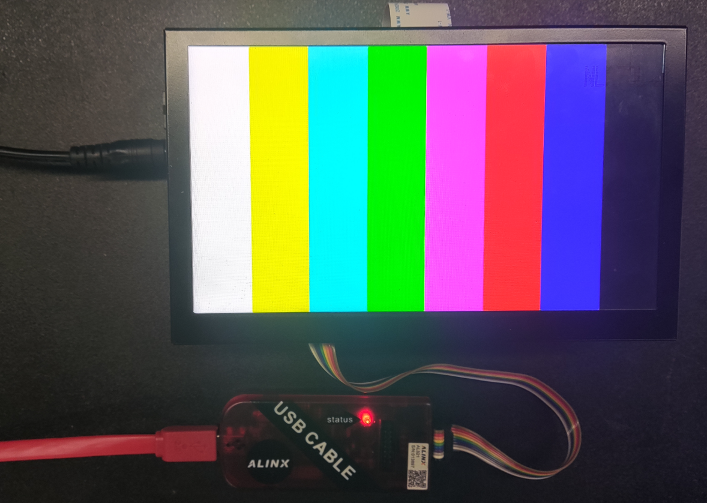

Chapter 4 LVDS LCD screen display experiment
=============================================

**The experimental Vivado project is "lvds_lcd".**

This chapter introduces the color bar display of lvds lcd LCD screen.

.. _Hardware Introduction-1:

Hardware introduction
--------------------------

ALINX black gold 7-inch LCD screen module (AN7000) uses IVO's 7-inch TFT LCD screen.
The model number of the LCD screen is M070AWAD R0. AN7000 LCD screen module is made of TFT
It consists of an LCD screen and a driver board. For specific parameters, please refer to the AN7000 user manual. The actual photos of AN7000 are as follows:

.. image:: images/media/image119.png
  :alt: \_K4A5291

AN7000 LCD screen front view

programming
---------------

1) Like PL’s “Hello World” LED experiment, add a block
design, and add the CIPS core and configure it as PL Subsystem

.. image:: images/media/image120.png

2. Add LVDS LCD controller IP

.. image:: images/media/image121.png

3. Add Advanced IO Wizard and configure

.. image:: images/media/image122.png

.. image:: images/media/image123.png

4. Connect as follows

5. Add the color bar file, drag it to the block design, and connect it

.. image:: images/media/image126.png

Define VIDEO_1280_720 in video_define.v because the LCD resolution is 1280*720

6. Generate HDL file

.. image:: images/media/image128.png

7. Add some other signals

.. image:: images/media/image129.png

8. Constraint pins

.. image:: images/media/image130.png

9. Generate pdi file

.. image:: images/media/image51.png

Experimental phenomena
-------------------------

Connect the LCD screen, download the program, and you can see the color bar display.

.. image:: images/media/image131.png

