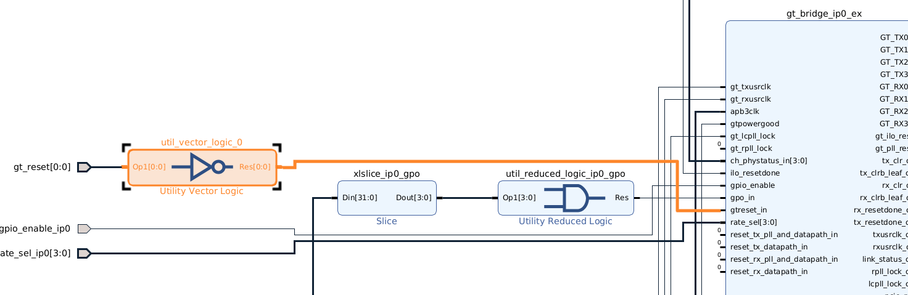
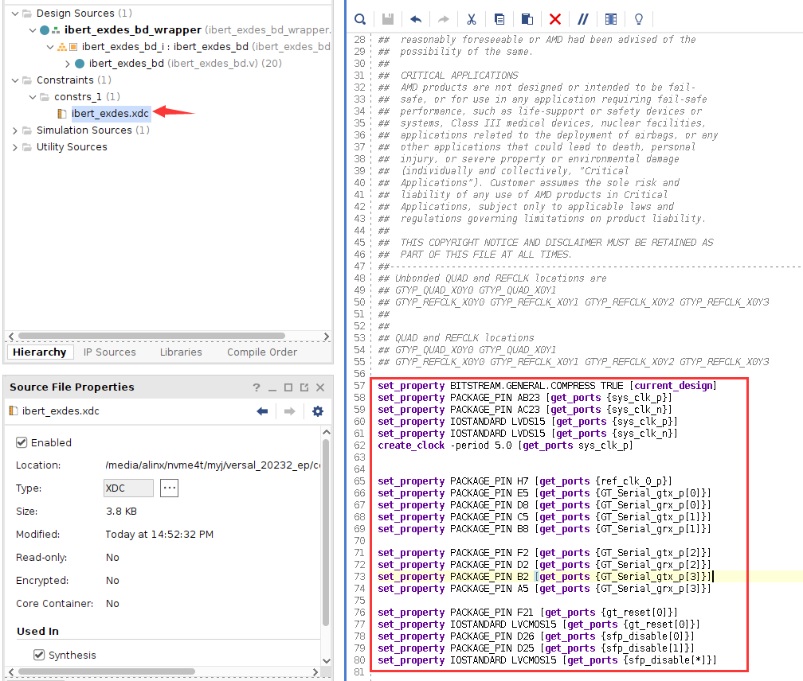

Chapter 5 GTYP transceiver bit error rate test IBERT experiment
=================================================================

**The experimental VIvado project is "ibert_test", and there is also "ibert_ex" in the directory, which is the generated test project.**

Vidado software provides us with the powerful bit error rate tester IBERT, which can not only test the bit error rate but also test the eye diagram, which brings great convenience to us in using high-speed transceivers. This experiment will serve as a starting point and briefly introduce the IBERT use.

.. _Hardware Introduction-2:

Hardware introduction
---------------------------

To use IBERT to test the bit error rate and eye diagram, you must have transceiver loopback hardware. There are two SFP optical interfaces on the development board. In this experiment, the two optical interfaces are connected in pairs to form two transceiver loopthrough links.

.. _vivado project creation-1:

Vivado project set up
------------------------

1) Create a new project named "ibert_test"

2) Search "gt" in "IP Catalog" to quickly find "Versal ACAPs Transceivers"
Wizard", double-click

3) Change "Component Name" to "ibert" and modify the preset to "Aurora 64B/66B"

.. image:: images/media/image134.png

4) Click Transceiver Configs Protocol 0, configure the sending and receiving parameters, and click OK

.. image:: images/media/image135.png

.. image:: images/media/image136.png

.. image:: images/media/image137.png

5) Click Generate

.. image:: images/media/image138.png

6) Right-click "Open IP Example Design..." and select the example project path

.. image:: images/media/image140.png

7) Add buffer to connect to apb3clk

.. image:: images/media/image141.png

8) Add inverter connected to reset

9) Some other signals are configured as constant 0

10) Delete output signal

11) Configure sfp_disable to 0

12) Change CIPS to PL Subsystem

.. image:: images/media/image146.png

13) Constraint pins

14) Generate pdi file

.. _Download Debug-1:

Download debugging
--------------------

1) Insert the optical module, then use optical fiber to connect the two optical ports, connect the JTAG download cable, and power on the development board

2) Use JTAG to download the BIT file to the development board. You can see that the speed is close to 10.3125Gbps.

.. image:: images/media/image150.png

3) Select IBERT, right-click and select "Create Links"

.. image:: images/media/image151.png

Referring to the schematic diagram, the optical fiber is connected to CH0 and CH1 of Quad104. Select Link 0 as Quad_104 CH_0
TX corresponds to CH1 RX, Link 1 corresponds to Quad_104 CH_1 TX and CH0 RX

4) Modify the configuration, select PRBS 31 for the code stream, and configure Loopback to None

.. image:: images/media/image153.png

5) After configuration, you can click BERT Reset. You can see that the Errors are all 0 and restart the test.

6) Select a link, right-click "Create Scan..."

.. image:: images/media/image155.png

7) The eye diagram configured by default. Note: The measured eye diagram may be different when using different software versions.

.. image:: images/media/image157.png
