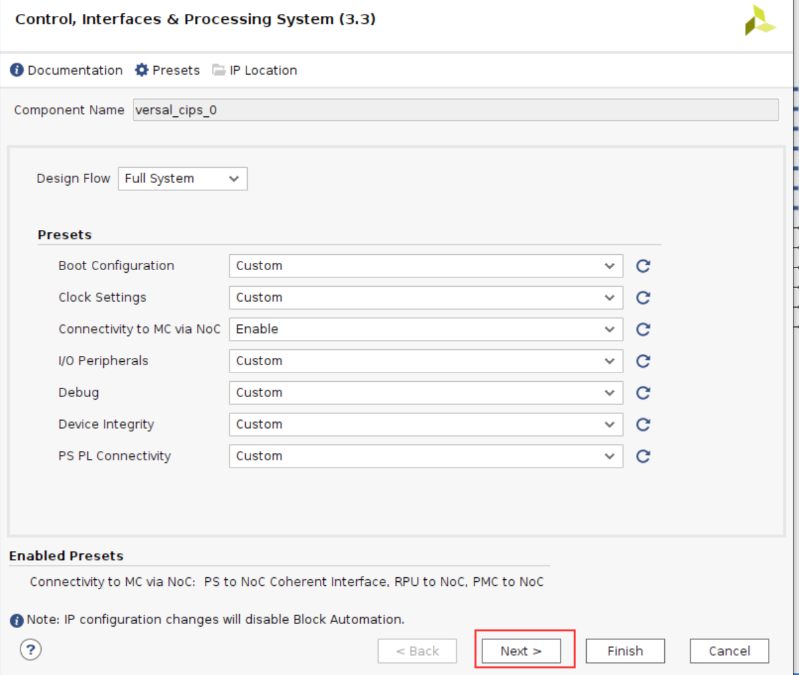
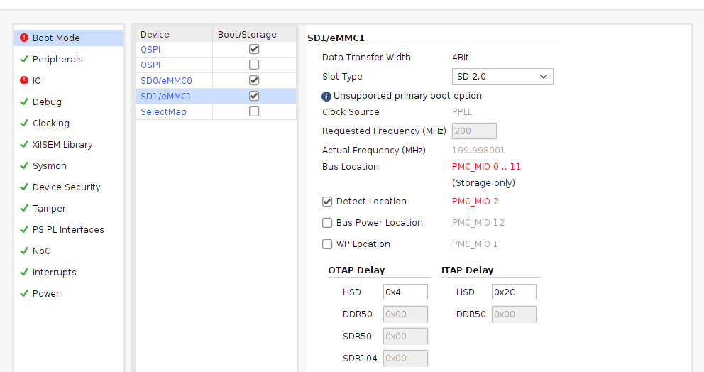
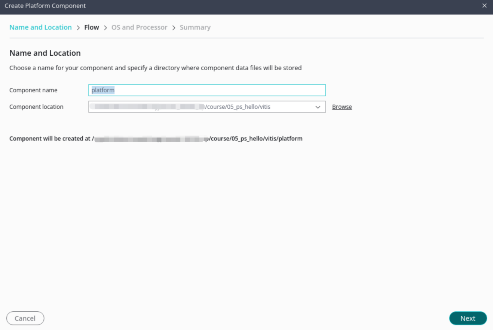
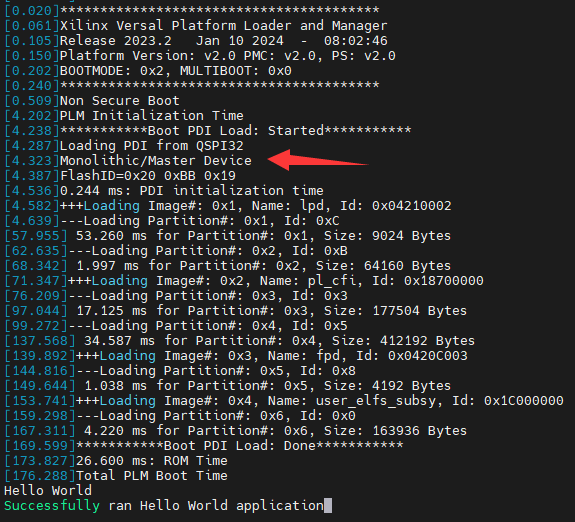

Chapter 6 Experience ARM, bare metal output "Hello World"
===========================================================

**From this chapter onwards, FPGA engineers and software development engineers collaborate to implement it.**

The previous experiments were all conducted on the PL side. It can be seen that there is no difference from the ordinary FPGA development process. The main advantage of ZYNQ is the reasonable combination of FPGA and ARM, which puts forward higher requirements for developers. Starting from this chapter, we start to use ARM, which is what we call PS. In this chapter, we use a simple serial port printing to experience Vivado
Vitis and PS side features.

The previous experiments are all things that FPGA engineers should do. From the beginning of this chapter, there is a division of labor. FPGA engineers are responsible for setting up the Vivado project and providing good hardware to software developers. Software developers can develop applications on this basis. . A good division of labor is also conducive to the advancement of the project. If a software developer wants to do everything, it may take a lot of time and energy to learn FPGA knowledge. Converting from software thinking to hardware thinking is a relatively painful process. If you just want to learn purely and have time, you can That's another matter. Professional people doing professional things is a good choice.

.. _Hardware Introduction-3:

Hardware introduction
----------------------------

We can see from the schematic diagram that the ZYNQ chip is divided into PL and PS. The IO allocation on the PS side is relatively fixed and cannot be allocated arbitrarily, and there is no need to allocate pins in the Vivado software. Although this experiment only used PS, it still To create a Vivado project to configure PS pins. Although the ARM on the PS side is a hard core, in ZYNQ the ARM hard core must be added to the project before it can be used. The previous chapters introduced projects in the form of codes. This chapter begins by introducing ZYNQ's graphical approach to building projects.

FPGA engineer job content
-------------------------------

The following introduces what FPGA engineers are responsible for.

.. _vivado project creation-2:

Vivado project set up
--------------------------

1) Create a project named "ps_hello". The establishment process will not be described in detail. Please refer to "PL's" Hello
World "LED Experiment".

2) Click "Create Block Design" to create a Block design

.. image:: images/media/image54.png

3) “Design
name" is not modified here, keep the default "design_1", you can modify it as needed, but the name should be as short as possible, otherwise there will be problems compiling under Windows.

.. image:: images/media/image88.png

4) Click the “Add IP” shortcut icon

.. image:: images/media/image56.png

5) Search for "PS" and double-click "Control, Interfaces & Processing" in the search results list
System"

.. image:: images/media/image57.png

6) Click Run Block Automation

.. image:: images/media/image158.png

7) Configure as follows, click OK

8) Automatic connection is as follows

.. image:: images/media/image160.png

9) Double-click CIPS to configure

.. image:: images/media/image162.png

select PS PMC to config

.. image:: images/media/image163.png

10) Config QSPI，EMMC，SD

.. image:: images/media/image165.png

Select the corresponding MIO

.. image:: images/media/image167.png

11) Check USB 2.0, GEM0, UART0, TTC, GPIO and other peripherals

Configure peripherals

.. image:: images/media/image169.png

12) Configure MIO24 as GPIO input, corresponding to the PS side buttons, and configure MIO25 as GPIO output, corresponding to the PS side LED lights

13) In clocking, set the reference clock more accurately

.. image:: images/media/image172.png

14) Check all internal interrupts, the configuration is complete, and click OK

.. image:: images/media/image173.png

15) Click Finish

16) Double-click AXI NoC to configure DDR4

.. image:: images/media/image175.png

.. image:: images/media/image177.png

select reference clock and system clock

.. image:: images/media/image178.png

DDR Address Region 1, select NONE and OK

1)  Modify pin name

.. image:: images/media/image180.png

Double-click to configure the frequency of sys_clk to 200MHz

.. image:: images/media/image181.png

18) Select the Block design, right-click "Create HDLWrapper...", create a Verilog or VHDL file for blockdesign generates HDL top-level files.

19) Keep the default options and click "OK"

.. image:: images/media/image183.png

20) Add constraint

.. image:: images/media/image184.png

.. image:: images/media/image185.png

.. image:: images/media/image186.png

21) Generate Device Image

.. image:: images/media/image187.png

22) Cancel after completion

.. image:: images/media/image188.png

23) File->Export->Export Hardware...

.. image:: images/media/image190.png

.. image:: images/media/image192.png

.. image:: images/media/image193.png

At this time, you can see the xsa file in the project directory. This file contains Vivado hardware design information and can be used by software developers.

.. image:: images/media/image194.png

At this point, the work of the FPGA engineer comes to an end.

Software engineer job content
---------------------------------

**The Vitis project directory is "ps_hello/vitis"**

The following is the responsibility of software engineers.

Debugging
------------

Create Application project
~~~~~~~~~~~~~~~~~~~~~~~~~~~~~~~~~

1) Create a new folder and copy the xx.xsa file exported by vivado.

2) Vitis is an independent software. You can double-click the Vitis software to open it, or select ToolsLaunch in the Vivado software.
VitisOpen Vitis software

.. image:: images/media/image9.png

On the welcome interface, click Open Workspace, select the previously created folder, and click "OK"

.. image:: images/media/image195.png

3) After starting Vitis, the interface is as follows, click "Create Platform"
Component", this option will create a Platform project, which is similar to previous versions of hardware
platform, including hardware support related files and BSP.

.. image:: images/media/image196.png

4) Fill in the Component name and path on the first page, keep the default, and click Next

5) Select (XSA, select "Browse", select the previously generated xsa, click to open, and then click Next

.. image:: images/media/image198.png

6) Select operating system and processor, keep the default here

.. image:: images/media/image199.png

7) Click Finish to complete

.. image:: images/media/image200.png

8) After generation, a window interface appears. The following are some window introductions. They are similar to the previous version of Vitis interface, but the differences are also quite large.

.. image:: images/media/image201.png

9) The platform can be compiled in the Flow window

.. image:: images/media/image202.png

no error status

.. image:: images/media/image203.png

10) Click Example on the left. There are many official routines here, which are similar to previous versions. Select Hello.
World

.. image:: images/media/image204.png

11) Click to create project

.. image:: images/media/image205.png

12) Fill in the project name and path and keep the default

.. image:: images/media/image206.png

13) Select the platform

14) Click Next

15) Complete

.. image:: images/media/image209.png

16) Select hello_world and click Build

.. image:: images/media/image210.png

.. _Download Debug-2:

Download debugging
~~~~~~~~~~~~~~~~~~~~~~~

1) Connect the JTAG cable to the development board and the UART USB cable to the PC

.. image:: images/media/image211.png

2) Before powering on, it is best to set the startup mode of the development board to JTAG mode and pull it to the "ON" position.

.. image:: images/media/image82.png

3) Power on the development board, open the serial port debugging tool, and click Run in Flow

.. image:: images/media/image212.png

4) At this time, observe the serial port debugging tool and you can see the output "Hello World"

.. image:: images/media/image213.png

firmware
-----------

Ordinary FPGAs can generally be started from flash or passively loaded. The startup process has been introduced in the PMC architecture in Chapter 1 and will not be introduced here.

Select Create Boot in Flow
Image, you can see the generated BIF file path in the pop-up window. The BIF file is the configuration file for generating the BOOT file, and the generated Output
Image file path, that is, the BOOT.pdi file is generated. It is the startup file we need. It can be placed in the SD card for startup, or it can be programmed to QSPI.
Flash.

.. image:: images/media/image214.png

.. image:: images/media/image215.png

The boot.pdi file can be found in the generated directory

SD card boot test
~~~~~~~~~~~~~~~~~~~~~~~

1) Format the SD card. It can only be formatted to FAT32 format. Other formats cannot be started.

.. image:: images/media/image217.png

2) Put the boot.pdi file into the root directory

.. image:: images/media/image218.png

3) Insert the SD card into the SD card slot of the development board

4) Adjust the startup mode to SD card startup

.. image:: images/media/image219.png

5) Open the serial port software, power on and start, you can see the printed information. The red box is the FSBL startup information, and the yellow arrow part is the executed application helloworld.

.. image:: images/media/image220.png

QSPI startup test
~~~~~~~~~~~~~~~~~~~~~~~

1) In the Vitis menu Vitis -> Program Flash

2) Select the boot.pdi to be burned in the Image FIle file. Select Verify after flash, Flash
Select qspi-x8-dual_parallel for Type, and verify the flash after programming is completed.

.. image:: images/media/image222.png

3) Click Program and wait for programming to complete

.. image:: images/media/image223.png

4) Set the startup mode to QSPI, start it again, and you can see the same startup effect as SD in the serial port software.

.. image:: images/media/image224.png

chapter summary
--------------------

This chapter introduces the classic process of Versal development from the perspectives of both FPGA engineers and software engineers. The main job of FPGA engineers is to build a hardware platform and provide hardware description files xsa to software engineers, who then develop applications based on this. This chapter is a simple example that introduces the collaborative work of FPGA and software engineers. It will also involve joint debugging between PS and PL later, which is more complicated and is also the core part of Versal development.

At the same time, FSBL, startup file production, SD card startup method, QSPI download and startup method are also introduced.

