Chapter 7 lwip used by PS side Ethernet
=========================================

**The vivado project directory is "ps_hello/vivado"**

.. _Software Engineer Job Content-1:

Software engineer job content
-------------------------------

The following is the responsibility of software engineers.

The development board has two channels of Gigabit Ethernet, connected through the RGMII interface. This experiment demonstrates how to use the LWIP template that comes with Vitis to perform Gigabit Ethernet TCP communication on the PS side.

Although LWIP is a lightweight protocol stack, if you have never used it before, it will be difficult to use it. It is recommended to familiarize yourself with the relevant knowledge of LWIP first.

Vitis program development
----------------------------

LWIP library modification
~~~~~~~~~~~~~~~~~~~~~~~~~~~~

Since the built-in LWIP library can only recognize some phy chips, if the phy chip used by the development board is not within the default support range, the library file must be modified. You can also directly use the modified library to replace the original library.

1) Find the library file directory "x:\\Xilinx2023.2\\Vitis\\2023.2\\data\\embeddedsw\\ThirdParty\\sw_services"

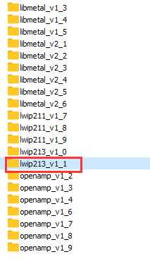

2) Find the files "xaxiemacif_physpeed.c" and "xemacpsif_physpeed.c" in the file directory "lwip213_v1_1\\src\\contrib\\ports\\xilinx\\netif" to be modified.

.. image:: images/media/image227.png

Mainly added get_phy_speed_ksz9031, get_phy_speed_JL2121 to support ksz9031 and JL2121 auto-negotiation to obtain speed. The modified lwip library is provided in the information and can be directly replaced.

Create an APP project based on the LWIP template
~~~~~~~~~~~~~~~~~~~~~~~~~~~~~~~~~~~~~~~~~~~~~~~~~~

1. Add lwip213 library to BSP

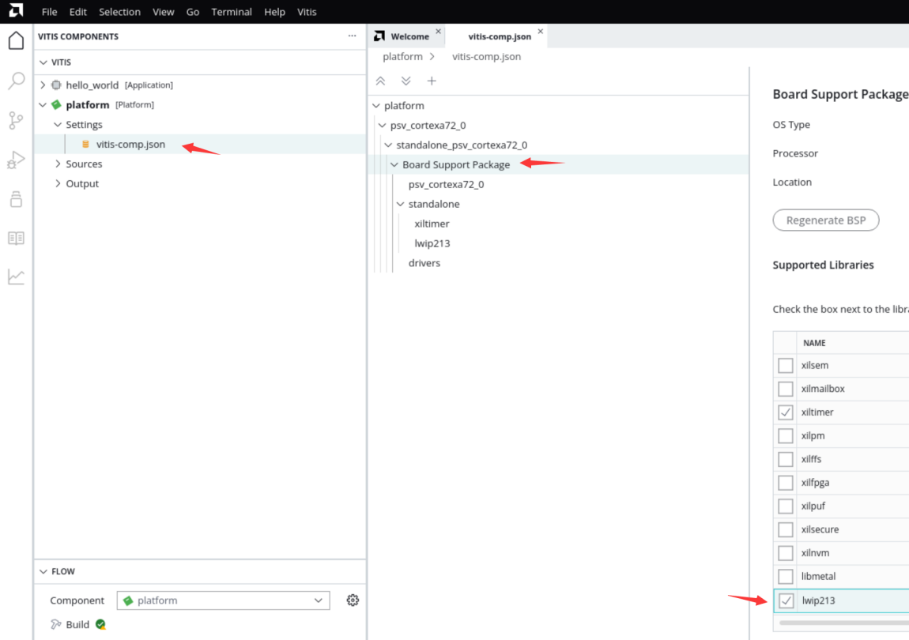

2. Configure the dhcp function to True

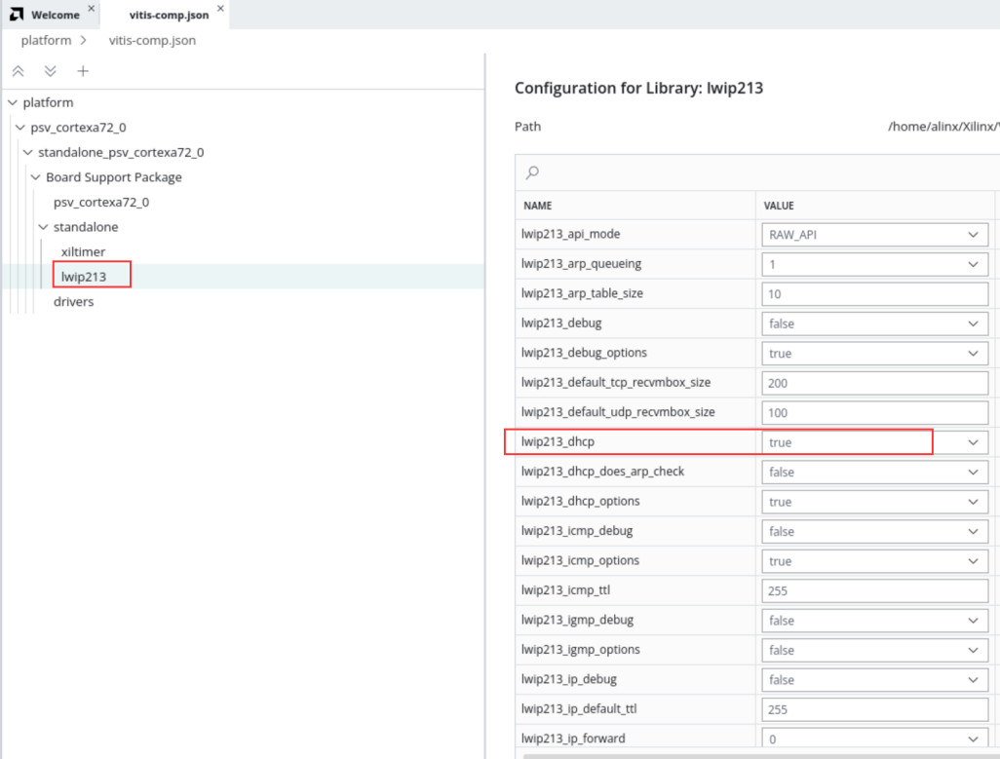

Build platform

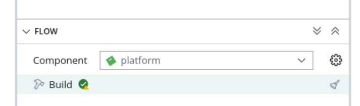

3. Select lwIP Echo Server template

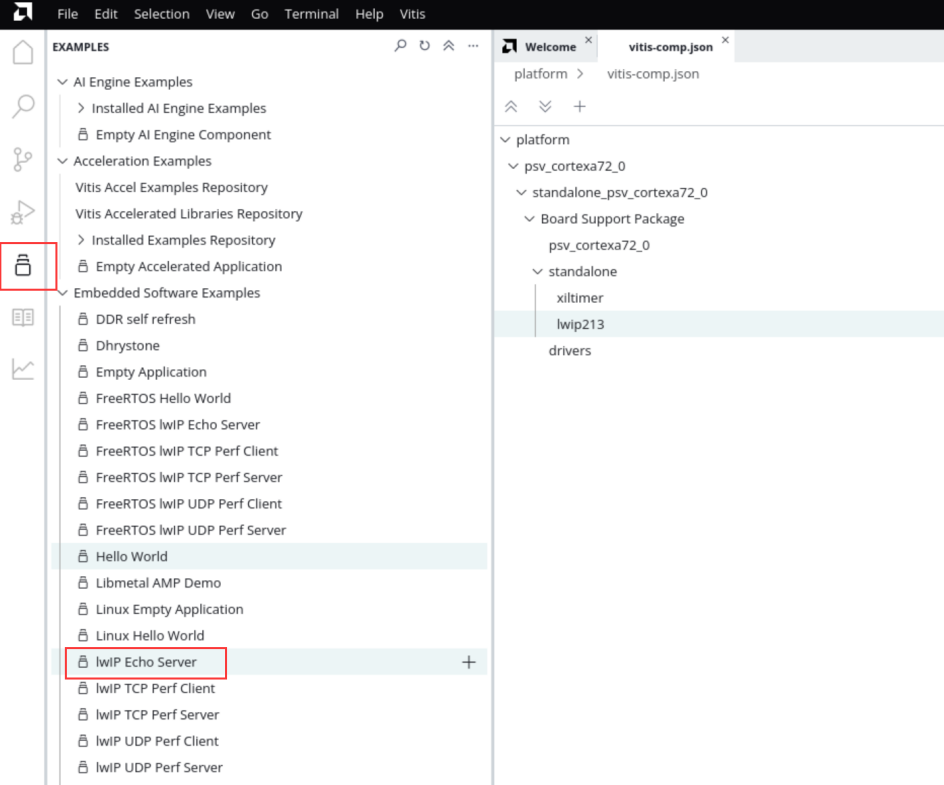

4. Generate template

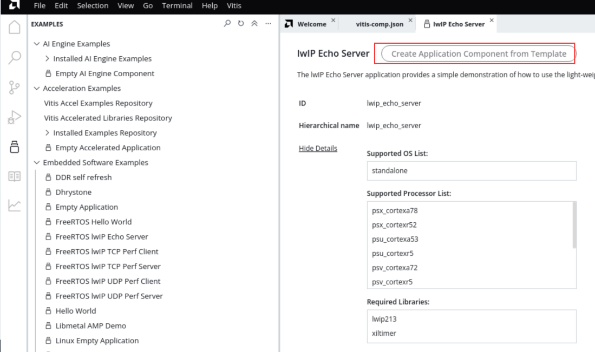

The process will not be described in detail. You can refer to Chapter 6 of Experience ARM, Bare Metal Output "Hello World"

5.Build

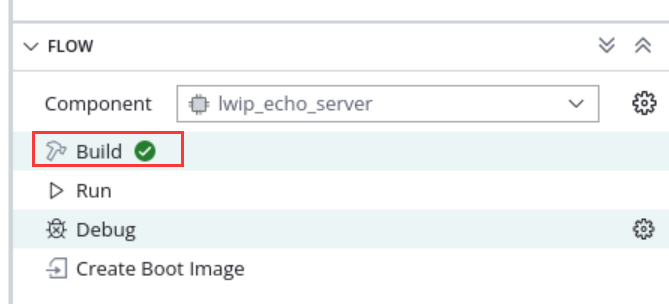

.. _Download Debug-3:

Download debugging
---------------------

The test environment requires a router that supports dhcp. The development board can automatically obtain an IP address when connected to the router. The experimental host and development board are on the same network and can communicate with each other.

Ethernet test
~~~~~~~~~~~~~~~~

1) Connect the serial port and open the serial debugging terminal, connect the PS end Ethernet cable to the router, and run the Vitis download program

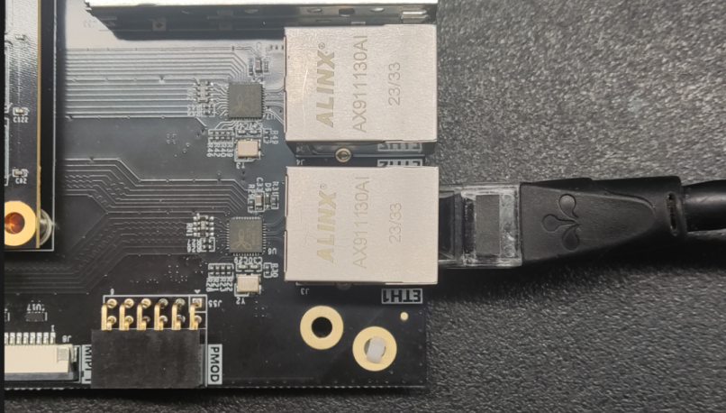

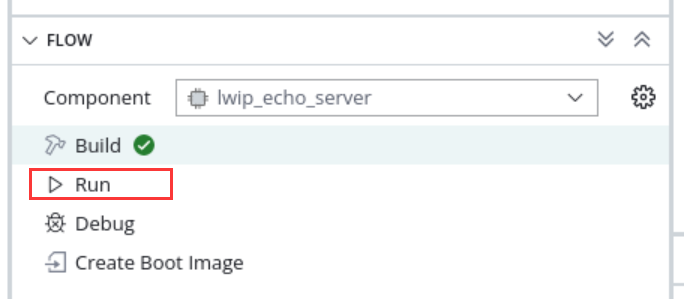

2) You can see some information printed out by the serial port. You can see that the address automatically obtained is "192.168.1.63", the connection speed is 1000Mbps, and the tcp port is 7

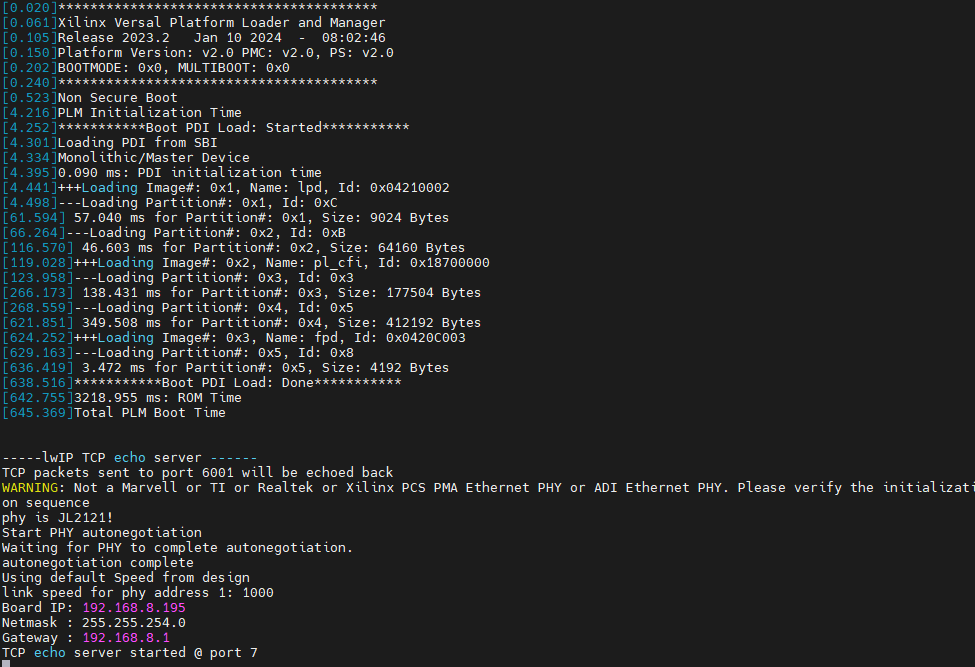

3) Use telnet to connect

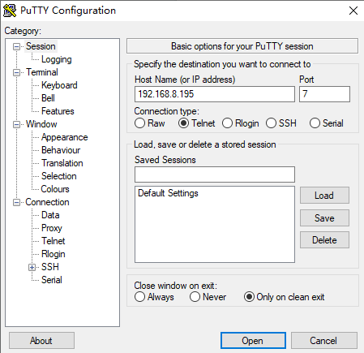

4) When a character is entered, the development board returns the same character

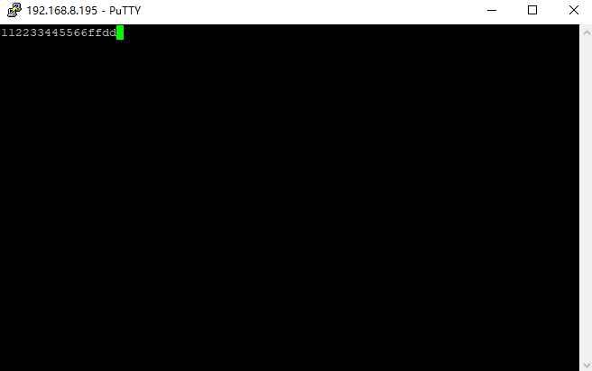

.. _Experiment Summary-2:

Experiment summary
--------------------

Through the experiment, we have a deeper understanding of the development of the Vitis program. This experiment simply explains how to create an LWIP application. LWIP can complete UDP, TCP and other protocols. In subsequent tutorials, we will provide specific applications based on Ethernet, such as cameras. The data is sent to the host computer via Ethernet for display.
