Chapter 8 Overall engineering and experiments
================================================

This chapter integrates most of the peripherals of the board into the Vivado project.

.. _vivado project creation-3:

Vivado project set up
-------------------------

The overall block diagram is as follows. Two MIPI cameras write to DDR4 and LVDS through VDMA.
The LCD reads image data from DDR4 via VDMA. The specific construction process will not be described. The Vivado project can be restored through TCL scripts.

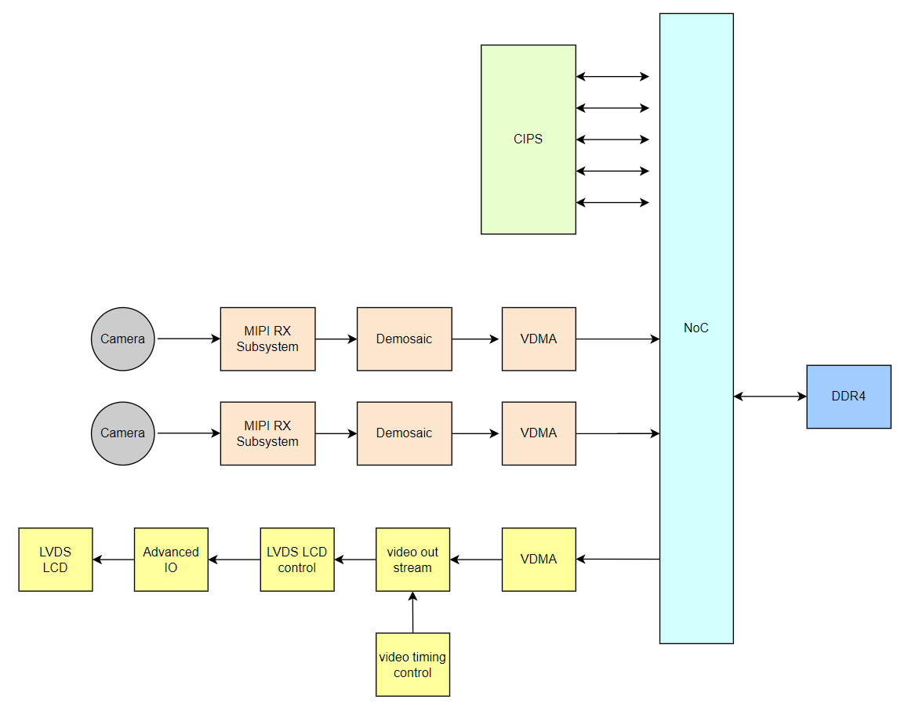

Vitis experiment
--------------------

LVDS LCD display experiment based on VDMA
~~~~~~~~~~~~~~~~~~~~~~~~~~~~~~~~~~~~~~~~~~~

The main function of this experiment is that ARM makes a color bar in DDR, VDMA reads this space and sends it to LVDS
LCD display module. Download program:

.. image:: images/media/image241.png

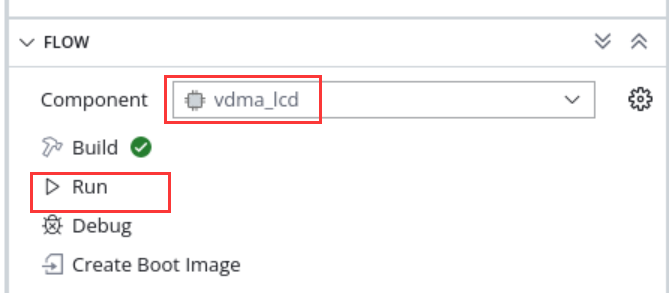

The displayed results are as follows:

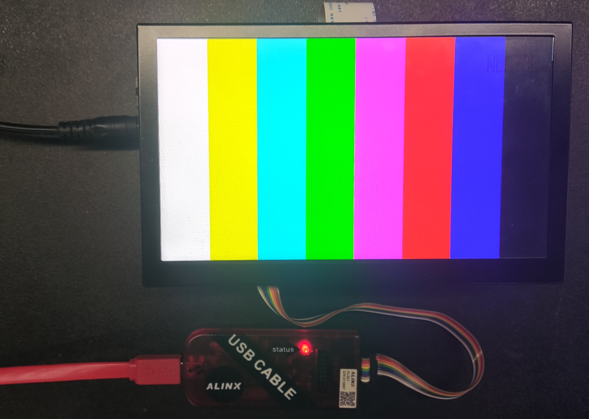

MIPI camera acquisition and display experiment
~~~~~~~~~~~~~~~~~~~~~~~~~~~~~~~~~~~~~~~~~~~~~~~~~

The main function of this experiment is to configure a single or two MIPI cameras and display images on the LCD, which is also implemented through VDMA.

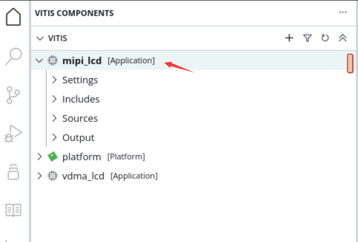

Run downloader

.. image:: images/media/image244.png

If you want to display a single or two cameras, you can modify the macro definition in config.h, recompile and download it.

.. image:: images/media/image245.png

display effect

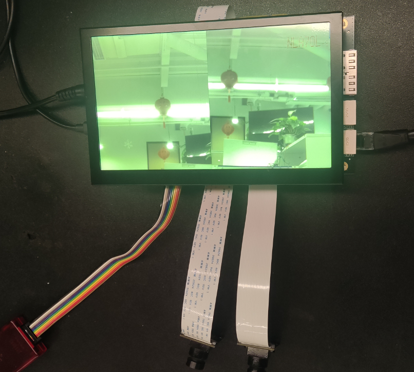

MIPI camera binocular acquisition Ethernet transmission experiment
~~~~~~~~~~~~~~~~~~~~~~~~~~~~~~~~~~~~~~~~~~~~~~~~~~~~~~~~~~~~~~~~~~~~~~

The LCD display of the MIPI camera was introduced earlier, but in some cases, the video needs to be transmitted to the host computer, and the Ethernet can be used to transmit the data. This chapter uses LWIP udp to transmit the camera data to the host computer.

The following introduces part of the content of LWIP. When communicating with the host computer, UDP transmission is used, and the protocol is customized in the UDP data packet, as shown below:

1. Obtain board information

(1) Query command (5 bytes in total, sent by the host computer through Ethernet)

+----------------------+--------------+------------------------------+
| Number of bytes      | 1            | 4                            |
+----------------------+--------------+------------------------------+
| Command information  | Header       | 0x00020001                   |
+----------------------+--------------+------------------------------+

(2) Response command (16 bytes in total, sent by the development board through Ethernet)

+---------------+----------------------------------------------------+
|Number of bytes|Command information                                 |
+---------------+----------------------------------------------------+
| 1             | Header|0x01                                        |
+---------------+----------------------------------------------------+
| 4             | 0x00020001                                         |
+---------------+----------------------------------------------------+
| 6             | Board MAC address                                  |
+---------------+----------------------------------------------------+
| 4             | Board IP address                                   |
+---------------+----------------------------------------------------+
| 1             | 0x02                                               |
+---------------+----------------------------------------------------+

1. Obtain data

(1) Control command (data request sent by the host computer)

+---------------+-------------------------------------------------------------------------------------------------------------------------+
|Number of bytes|Command information                                                                                                      |
+---------------+-------------------------------------------------------------------------------------------------------------------------+
| 1             | Header                                                                                                                  |
+---------------+-------------------------------------------------------------------------------------------------------------------------+
| 4             | 0x00020002                                                                                                              |
+---------------+-------------------------------------------------------------------------------------------------------------------------+
| 6             | Board MAC address                                                                                                       |
+---------------+-------------------------------------------------------------------------------------------------------------------------+
| 1             | Camera channel selection, a value of 1 means only turning on camera                                                     |
|               | Header 1, the value 2 means opening only camera 2, the value 3 means opening both cameras at the same time              |
+---------------+-------------------------------------------------------------------------------------------------------------------------+
| 1             | Start signal, 0 means turning off the upper image display, other means turning on the image display                     |
+---------------+-------------------------------------------------------------------------------------------------------------------------+

(2) Response command (sent by development board)

+---------------+-----------------------------------------------------------------------------------------------+
|Number of bytes| Command information                                                                           |
+---------------+-----------------------------------------------------------------------------------------------+
| 1             | Header|0x 01                                                                                  |
+---------------+-----------------------------------------------------------------------------------------------+
| 3             | 0x 000200                                                                                     |
+---------------+-----------------------------------------------------------------------------------------------+
| 1             | Channel identification, the value 2 represents camera 1, the value 3 represents camera 2      |
+---------------+-----------------------------------------------------------------------------------------------+
| 3             | Serial number, Ethernet packet sequence number, used for host computer identification         |
+---------------+-----------------------------------------------------------------------------------------------+
| N             | Image data                                                                                    |
+---------------+-----------------------------------------------------------------------------------------------+

Each UDP packet contains a Header, in the first byte, with the following format:

+----------------------+----------------------+--------------------+
| bit                  | value(0)             | value(1)           |
+----------------------+----------------------+--------------------+
| bit 0                | Query or control     | Reply              |
+----------------------+----------------------+--------------------+
| bit1~bit7            | Random data          |                    |
+----------------------+----------------------+--------------------+

Note: When responding, the upper 7 bits of random data remain unchanged and bit0 is set to 1

The workflow is:

1) The host computer sends an inquiry command

2) Development board responds to inquiries

3) The host computer sends control command request data

4) The development board sends data

5) Cycle of steps 3 and 4

Experimental steps
^^^^^^^^^^^^^^^^^^^^^^^^

1. If you check the lwip library in vitis

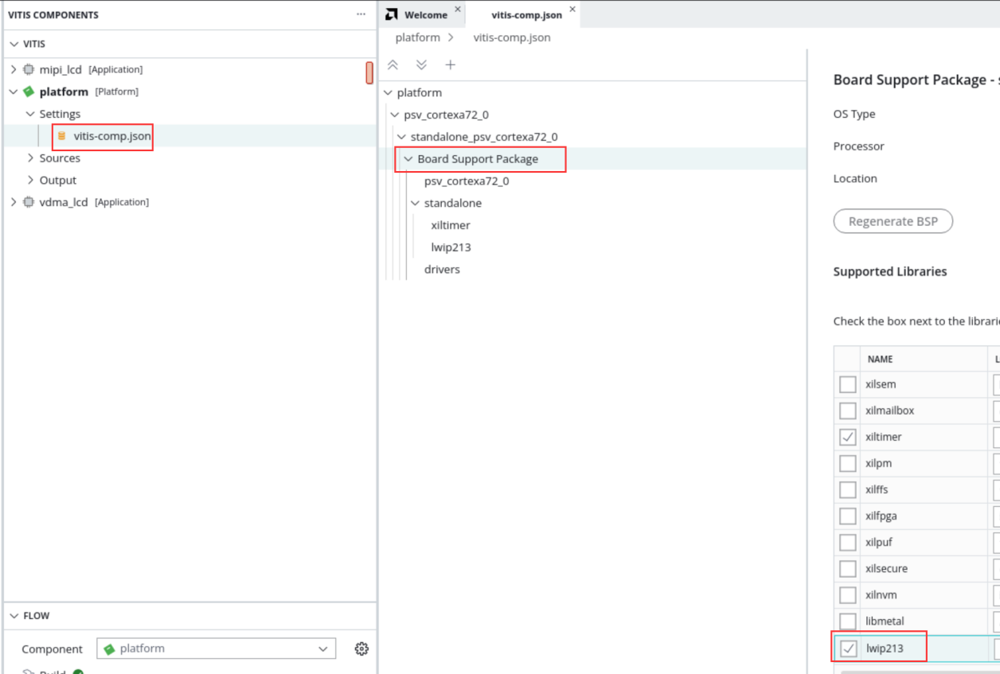

And do parameter configuration

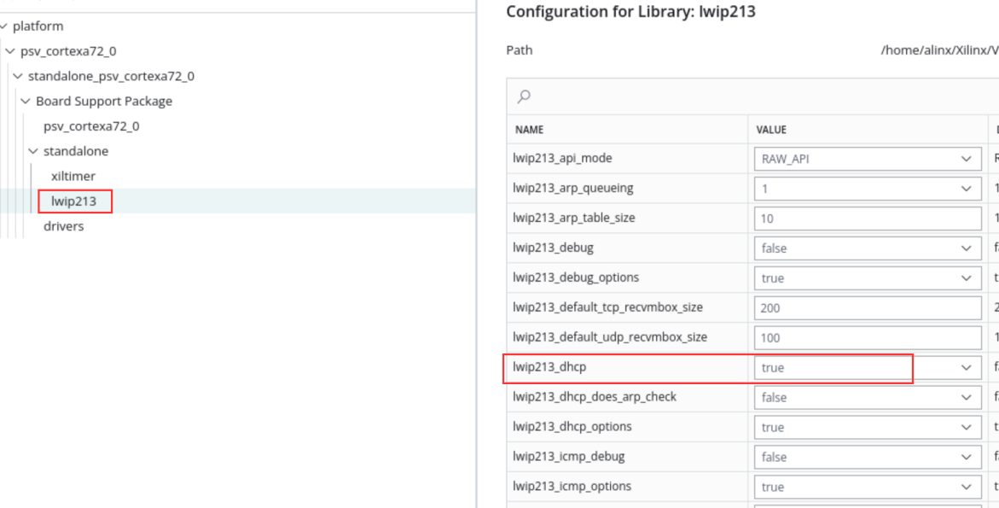

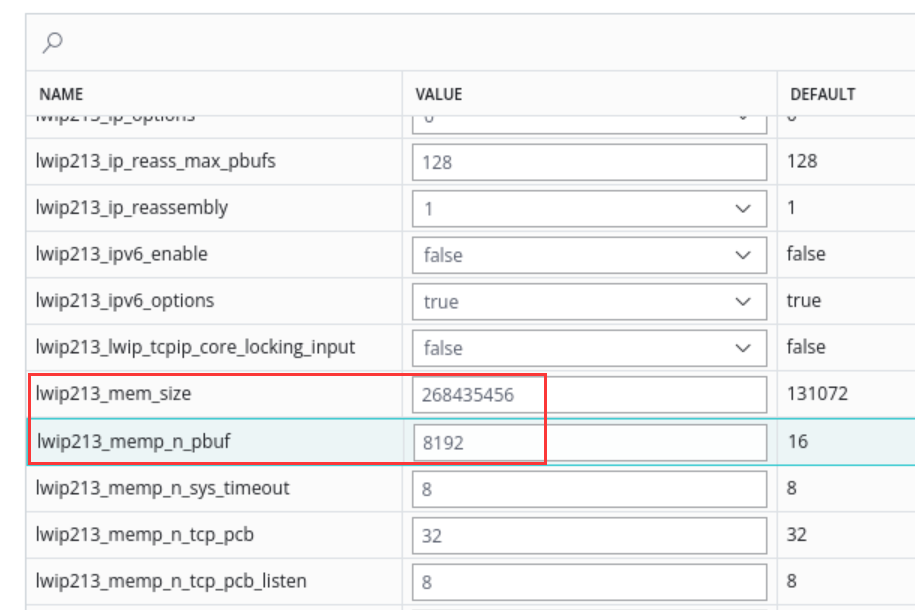

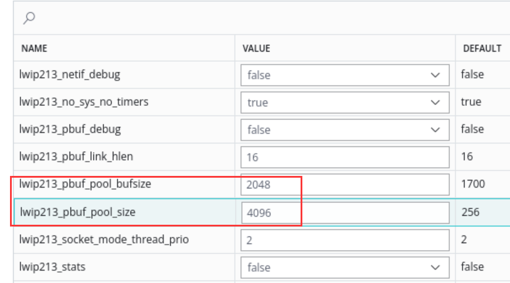

Recompile the platform

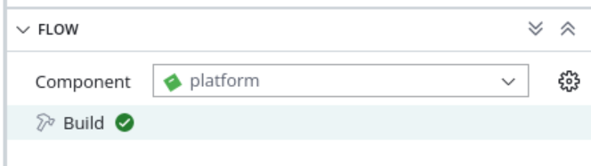

2. Build the project, connect the board camera, power supply, serial port, PS port ETH1, then click Run to download the program

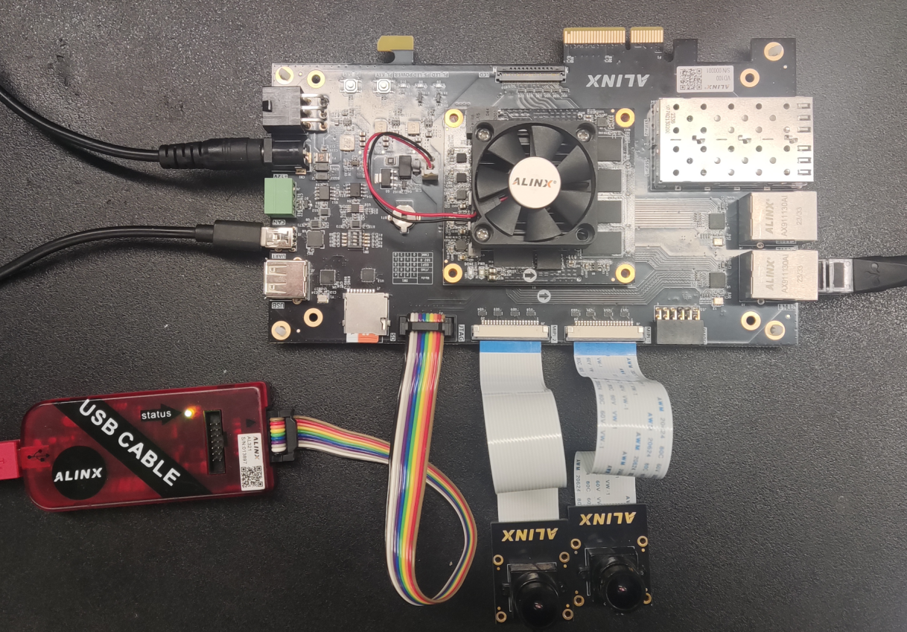

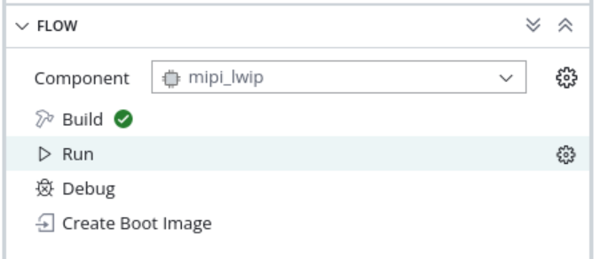

3. If there is a DHCP server, the IP will be automatically assigned to the development board; if there is no DHCP server, the default development board IP address is 192.168.1.10. You need to set the IP address of the PC to the same network segment, as shown in the figure below. At the same time, make sure that there is no IP address of 192.168.1.10 in the network, otherwise it will cause an IP conflict and prevent the image from being displayed. You can enter ping in CMD before the board is powered on.
192.168.1.10 Check whether it can be pinged successfully. If it is successfully pinged, it means that this IP address exists in the network and cannot be verified.

..

After there is no problem, open the serial port software.

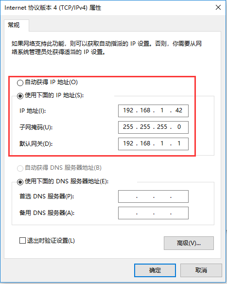

4. The serial port print information is as follows, the network card speed is detected and the IP address is set.

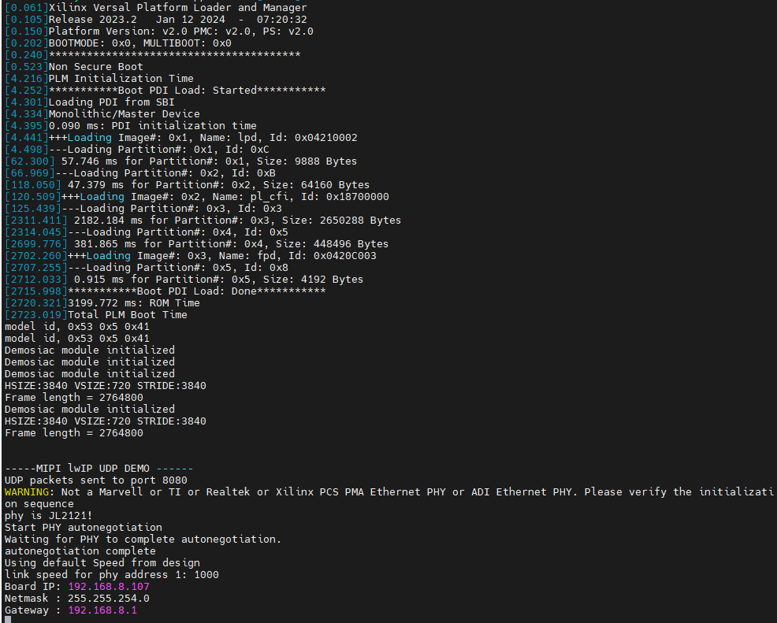

5. Open the Vivado project folder and open videoshow.exe

The software scans two cameras. You can select the corresponding camera to display by checking it, and click to play.

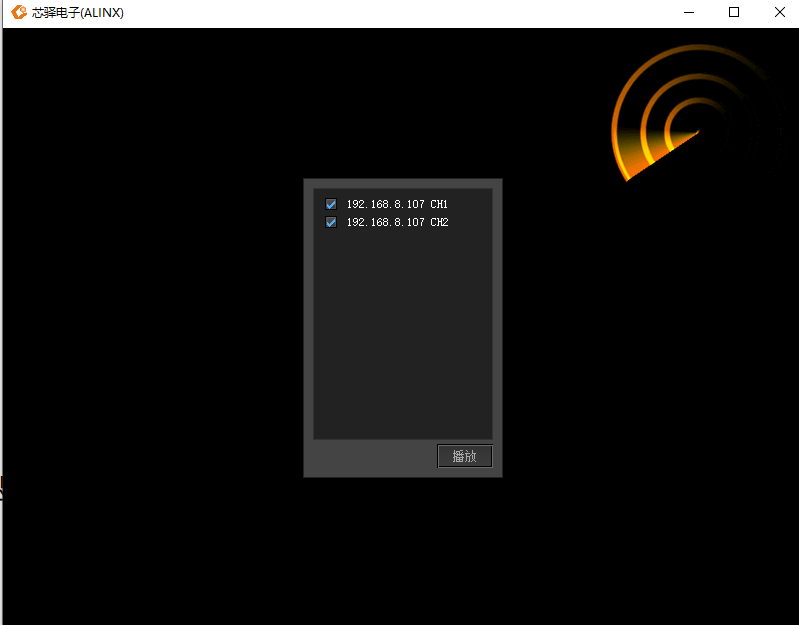

The display effect is as follows. If you want to reselect the display channel, double-click on the software screen to return to the selection interface and select the image to be displayed again.

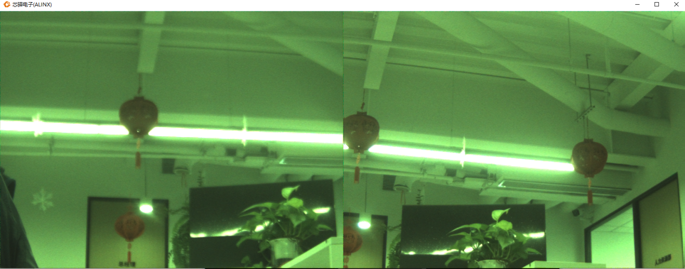

6. Open the task manager and you can see that the network bandwidth is about 750Mbps

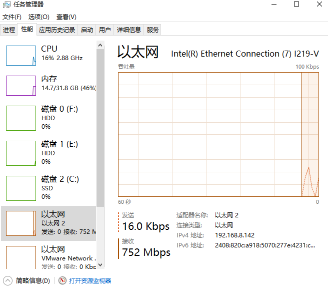
