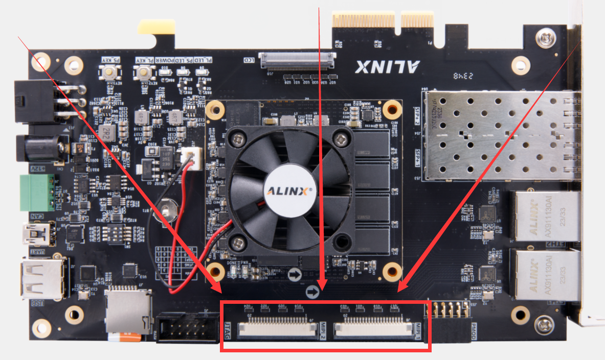
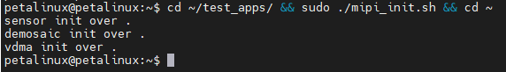

第七章 MIPI摄像头
==================

-  | MIPI摄像头接口在VD100开发板的这个位置：
   | |IMG_256|

-  | 接上MIPI摄像头后状态如下：
   | |IMG_257|

在开发板Linux系统中显示MIPI摄像头
---------------------------------

-  | STEP1：系统启动并登录后，调用初始化脚本初始化MIPI摄像头相关的IP：
   | ``cd ~/test_apps/ && sudo ./mipi_init.sh && cd ~``
   | |IMG_258|

-  | STEP2：运行 ``sudo ~/test_apps/mipi_senser0_show`` 程序显示MIPI1摄像头
   | |IMG_259|
   | |IMG_260|

-  | STEP3：运行 ``sudo ~/test_apps/mipi_senser1_show`` 程序显示MIPI2摄像头
   | |IMG_261|
   | |IMG_262|

PS：mipi_senserx_show 程序源码在这里 *demo/course_s2/applications/qtProject/mipi_camera* 。关于如何使用QTCreator编译这个程序，请参考 *4_安装QT库和OPENCV库以及在QTCreator中设置编译环境.rst*。

也可以在MatchBox桌面上用鼠标来运行这些程序
---------------------------------------------

-  | STEP1:单击 File Manager PC... 图标:
   | |IMG_263|

-  | 双击文件夹进入到程序所在的路径:
   | |IMG_264|

-  | 双击程序以运行，弹窗后单机右下角的 Execute 按钮:
   | |IMG_265|

-  | 程序执行:
   | |IMG_266|

.. |IMG_257| image:: images/vertopal_84eff292e3e047f3abab914d5565a88f/media/image2.jpeg

.. |IMG_259| image:: images/vertopal_84eff292e3e047f3abab914d5565a88f/media/image4.png
.. |IMG_260| image:: images/vertopal_84eff292e3e047f3abab914d5565a88f/media/image5.png
.. |IMG_261| image:: images/vertopal_84eff292e3e047f3abab914d5565a88f/media/image6.png
.. |IMG_262| image:: images/vertopal_84eff292e3e047f3abab914d5565a88f/media/image7.png
.. |IMG_263| image:: images/vertopal_84eff292e3e047f3abab914d5565a88f/media/image8.png
.. |IMG_264| image:: images/vertopal_84eff292e3e047f3abab914d5565a88f/media/image9.png
.. |IMG_265| image:: images/vertopal_84eff292e3e047f3abab914d5565a88f/media/image10.png
.. |IMG_266| image:: images/vertopal_84eff292e3e047f3abab914d5565a88f/media/image11.png
