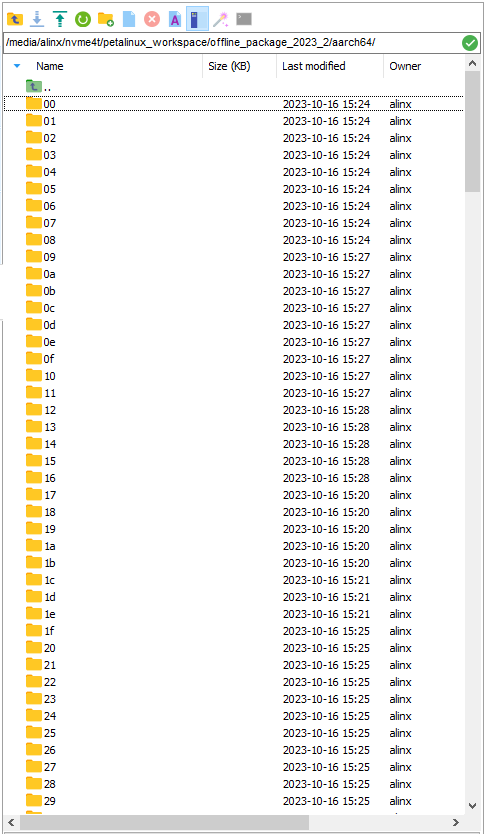
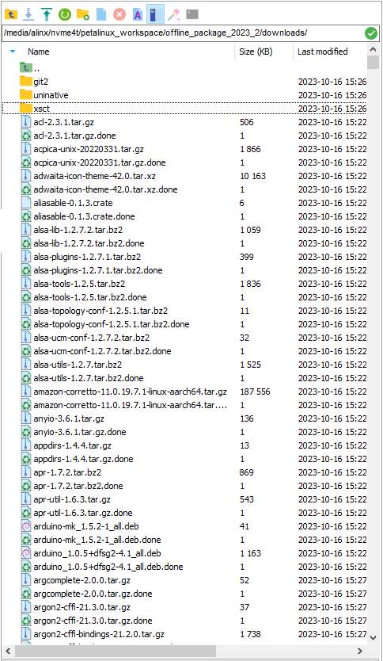
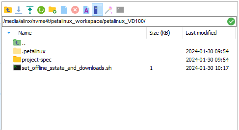
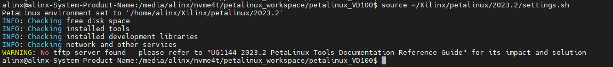
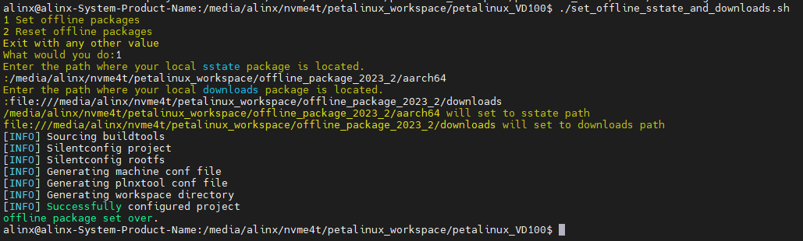
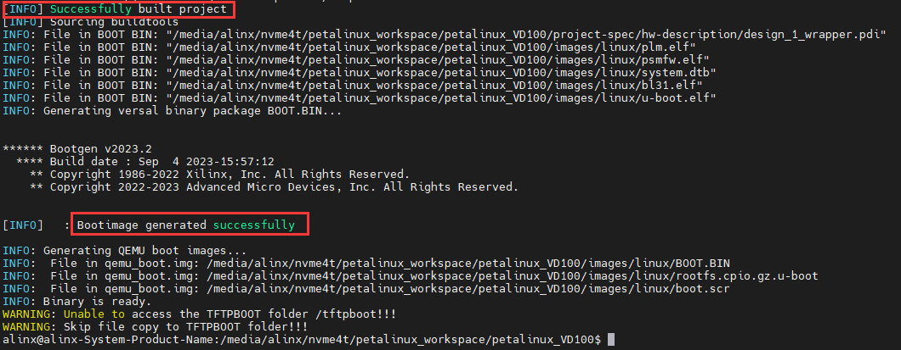

About PETALINUX
================================

Foreword
--------

-  The petalinux project is usually strongly associated with the vivado project, and the petalinux project we provide in the *course_s2/petalinux* path also adds a lot of configuration to the *course_s2/documentations/vivado* project we provide. The vivado project and petalinux provided by us cover most of the interfaces of the VD100 development board. If you are using Linux on the VD100 for the first time, it is recommended that you experience the petalinux project provided by us first.

-  Use the engineering and routines **Be sure to use the 2023.2 version of the XILINX Development Kit** we provide, including Vivado, `Petalinux <https://www.xilinx.com/member/forms/download/xef.html?filename=petalinux-v2023.2-10121855-installer.run>`_ and others.

-  | About \  * * offline compilation * * \ : When compiling the Petalinux project, a large number of necessary resources will be obtained from the Internet. The compilation speed also depends on the network speed. If the network is unstable, the compilation may fail after waiting for a long time. Therefore \  * * offline compilation * * \  is recommended. First, download the offline resource `aarch64 sstate-cache <https://www.xilinx.com/member/forms/download/xef.html?filename=sstate_aarch64_2023.2_10121051.tar.gz>`_ package required for offline compilation from **AMD|XILINX** the official website `Downloads <https://www.xilinx.com/member/forms/download/xef.html?filename=downloads_2023.2_10121051.tar.gz>`_ to the Ubuntu system folder and decompress it (after decompression, you can delete the compressed package). See the following figure:
   | |IMG_256| |IMG_257| |
   | Record the path of these two packages ( **What is recorded here is my path. Please make a record according to the path you actually store.**):
   | /media/alinx/nvme4t/petalinux_workspace/offline_package_2023_2/aarch64
   | **file://**/media/alinx/nvme4t/petalinux_workspace/offline_package_2023_2/downloads
   | Note that the path of the downloads package needs to be **file://** prefixed. How to use these two paths to set up the offline compilation of the petalinux project will be described later.

Use PETALINUX project folder in this path
-----------------------------------------

1. | *course_s2/petalinux* Copy all the files in the path to the Ubuntu system folder, as shown below (note that the.petalinux folder is hidden by default in Ubuntu):
   | |IMG_258|

2. | Open the terminal in this path and set the environment variable for petalinux.
   | If your Petalinux tool is installed in the ~/Xilinx/petalinux/2023.2 path as I did, use the following command to set the environment variables:
   | ``source ~/Xilinx/petalinux/2023.2/settings.sh``
   | |IMG_259|

3. Next, set up offline compilation using the previously documented offline package (if you don't need to use offline compilation, you can skip this step). Run this command to set up offline compilation:
   | ``chmod +x./set_offline_sstate_and_downloads.sh &&./set_offline_sstate_and_downloads.sh``
   | Enter 1 to set offline compilation, enter 2 to restore online compilation, and enter any other value to exit the script:
   | |IMG_260|
   | Here I select **1**, and then first enter **aarch64 sstate-cache** the path of the package and then press enter,
   | Enter **downloads** the path of the resource bundle. Press Enter to wait for the prompt **[INFO] Successfully configured project** and **offline package set over** then the setup is complete:
   | |IMG_261|

4. | Now you can compile the petalinux project. Enter the following command in the terminal to compile the project and pack the BOOT. Bin after compiling:
   | ``petalinux-build && petalinux-package --boot --u-boot --force``
   | Even with offline compilation, the first compilation of each project takes a long time. When and **[INFO]   : Bootimage generated successfully** are prompted **[INFO] Successfully built project**, it means that the compilation is successful and the BOOT. Bin is packaged:
   | |IMG_262|

5. | Check the images/Linux path of the petalinux project, and here is the compiled and packaged file. We need the BOOT. Bin, image. UB, boot. SCR and rootfs. Tar. GZ to start LINUX on the development board.
   | |IMG_263|
   | For how to use these four files to make an SD card to boot Linux on the development board, please refer to: **1 _ Quick boot Linux-make SD card to boot the development board Linux system.rst**. After the development board is up, please refer to **3 _ Testing board peripherals in Linux** the series of documents to use the peripheral.

General PETALINUX Usage Procedure
---------------------------------

In fact, using the Petalinux project provided by us to make the board system will be different from the usual Petalinux use steps.

The general steps are as follows:

-  | STEP1: Create a petalinux project named petalinux of the versal template:
   | ``petalinux-create -t project --template versal -n petalinux``

-  | STEP2: Enter the petalinux project path and configure the hardware description file. Suppose I put the hardware description file.xsa \* in the same-level path **hardware** folder of the petalinux project:
   | ``cd./petalinux && petalinux-config --get-hw-description../hardware``

-  | STEP3: If there are no other settings required, you can compile the project and pack the BOOT. Bin after compilation.
   | ``petalinux-build && petalinux-package --boot --u-boot --force``

Please refer to **AMD|XILINX** the official document `UG1144(v2023.2) <https://docs.xilinx.com/r/en-US/ug1144-petalinux-tools-reference-guide>`_ for more detailed process.

.. |IMG_260| image:: images/vertopal_17eec26fe4a54994995614f5a65b6c4a/media/image5.png

.. |IMG_263| image:: images/vertopal_17eec26fe4a54994995614f5a65b6c4a/media/image8.png
