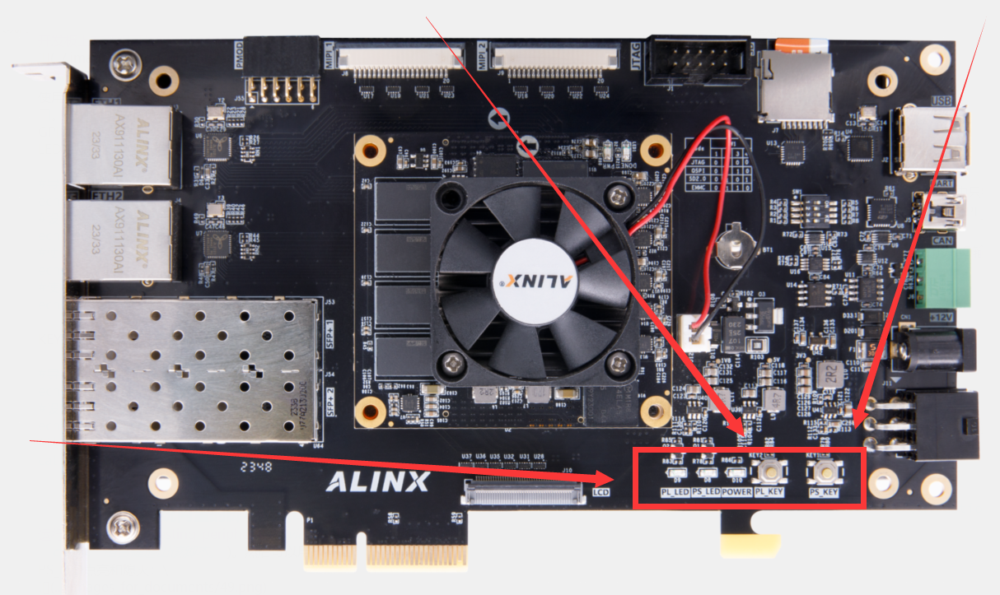
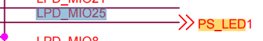
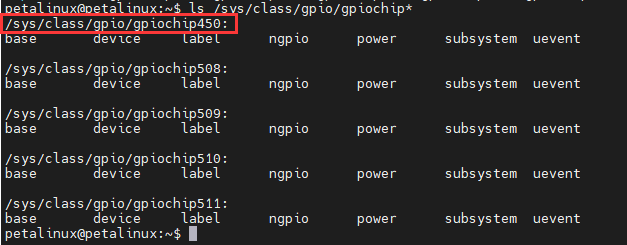
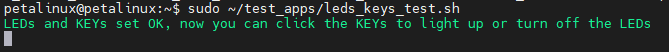

Chapter II LEDS, KEYS
=====================================

LEDs and KEY on the VD100 development board
-------------------------------------------

| There are two sets of controllable LEDs and keys on the development board. At the location indicated in the figure below:
| |IMG_256|

Using LEDs and KEY in Linux
---------------------------

| Using LED and KEY is actually configuring and using GPIO. In Linux, you only need to know the GPIO number to use the corresponding IO port. The GPIO number needs to be combined with the schematic diagram. Take PS _ LED as an example, the LPD _ MIO25 pin on the Versal chip is connected in the schematic diagram:
| |IMG_257|
| Enter the command ``ls/sys/class/gpio/gpiochip`` in the development board system, and the minimum value 450 after these gpiochips we see is the starting number of the LPD _ MIO group IO.
| |IMG_258|
| The number of IO corresponding to PS _ LED is 450 + 25, which is 475.
| In the development board system provided by us, the GPIO number of the PS _ LED is 475 and the GPIO number of the PS _ KEY is 474.
| The IO corresponding to LED needs to be configured as output. The steps for configuration and use are as follows:

| ``#导出对应的端口``
| ``sudo echo 475 >>/sys/class/gpio/export``
| ``#设置这个端口为输出``
| ``sudo echo out >>/sys/class/gpio/gpio475/direction``
| ``#使这个端口输出高电平，点亮LED``
| ``sudo echo 1 >>/sys/class/gpio/gpio475/value``
| ``#使这个端口输出低电平，熄灭LED``
| ``sudo echo 0 >>/sys/class/gpio/gpio475/value``

| The IO corresponding to KEY needs to be configured as input. The steps for configuration and use are as follows:

| ``#导出对应的端口``
| ``sudo echo 474 >>/sys/class/gpio/export``
| ``#设置这个端口为输入``
| ``sudo echo in >>/sys/class/gpio/gpio474/direction``
| ``#读取这个IO当前的电平状态``
| ``cat/sys/class/gpio/gpio474/value``

| In addition to this method, the GPIO can also be used by directly reading and writing registers. The PL _ LED and PL _ KEY are implemented using the axi-gpio IP, and their register addresses can be found in the vivado project as PL _ LED: 0x80040000, PL_KEY:0x80030000。
| Use the command ``sudo devmem 0x80030000`` to read out the value of the PL _ KEY.
| Use the command ``sudo devmem 0x80040000 32 1`` to light the PL _ LED;
| Use the command ``sudo devmem 0x80040000 32 0`` to turn off the PL _ LED.

Test the LED and KEY with the built-in script of the system
-----------------------------------------------------------

| Run ``sudo ~/test_apps/leds_keys_test.sh`` (PS: press the **ctrl+c** key combination to exit). The PS _ KEY can then be used to control the PS _ LED on and off, and the PL _ KEY can be used to control the PS _ LED on and off.
| |IMG_259|

