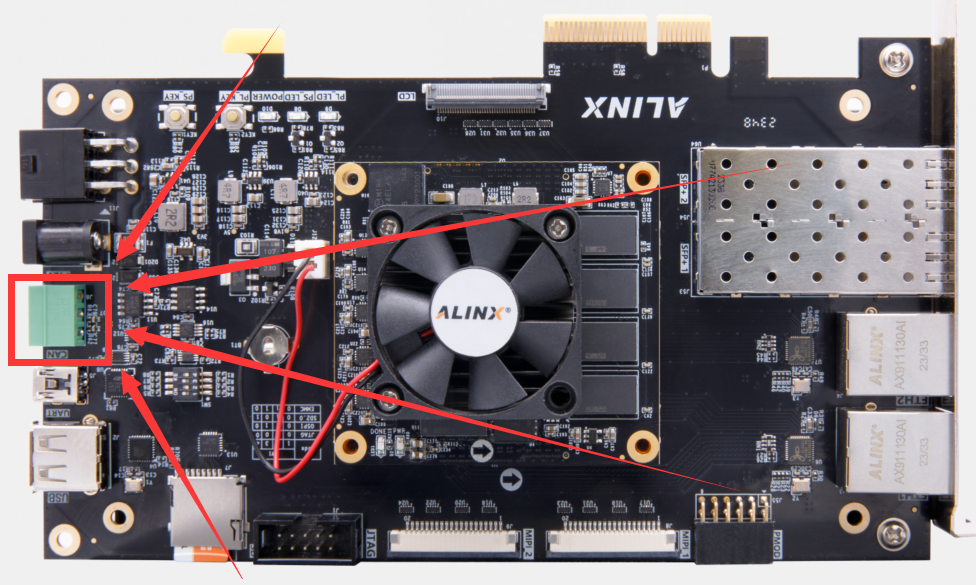
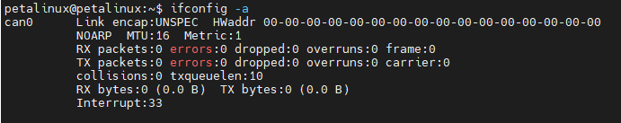
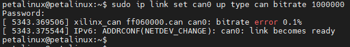
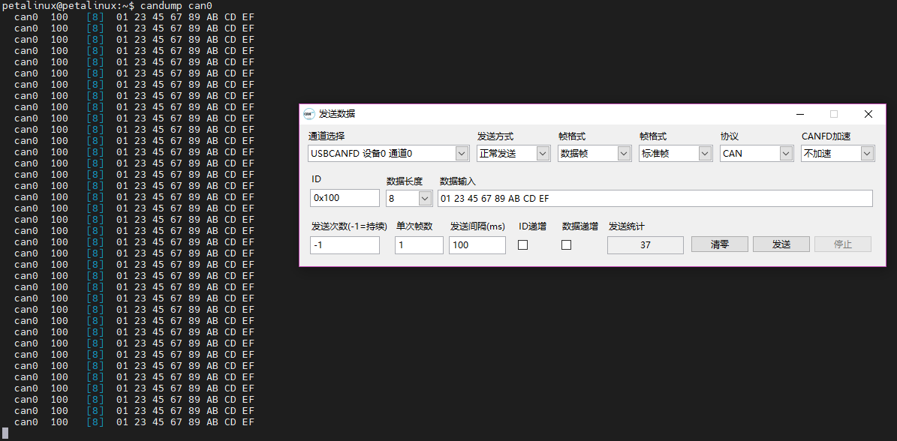
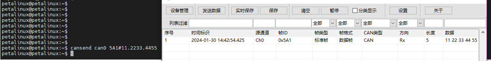

Chapter III CAN
==============================

CAN position on VD100
---------------------

| |IMG_256|

Using CAN in Linux
------------------

| There is only one CAN interface on the VD100 development board. To test the CAN interface, you need to connect it to a PC with the help of a CAN-to-USB tool.
| Using ``ifconfig -a`` the command on the development board system, you can see that there is a can on the development board, that is, can0:
| |IMG_257|
| Use this command to set the bitrate of can0 and start can0:
| ``sudo ip link set can0 up type can bitrate 1000000``
| |IMG_258|
| Use this command to receive the data received by can0:
| ``candump can0``
| At the same time, open the upper computer of the CAN to USB tool, set the same baud rate, send data, and you can see that the development board system has received the data sent by the upper computer:
| |IMG_259|

| With this command, the hexadecimal data "11 22 33 44 55" with ID "5A1" can be sent to the CAN bus via can0:
| ``cansend can0 5A1#11.2233.4455``
| This CAN message can also be received in our upper computer program:
| |IMG_260|

