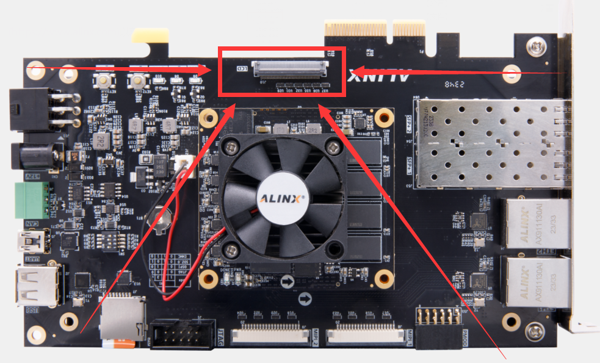
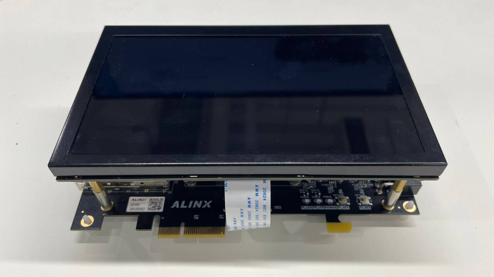
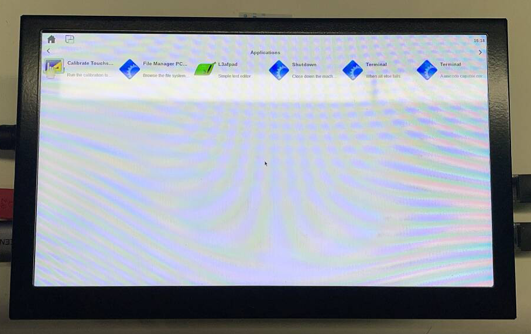

Chapter 4 LCD
===============================

| The LCD interface on the VD100 development board is at the location marked in the following figure:
| |IMG_256|
| See the following figure after connecting to the screen:
| |IMG_257|

| In the Linux system provided by us, the driver related to display is added: * demo/course _ S2/petalinux/project-spec/meta-user/recipes-modules/axlcd*,
| and device tree: * demo/course _ S2/petalinux/project-spec/meta-user/recipes-bsp/device-tree/files/system-user. Dtsi-L19 ~ 54*,
| ( **Both the driver and the device tree are related to the configuration in the vivado project and need to be used together**) X11 and MatchBox Easy Desktop are configured in the root file system.
| Launch the development board with our Linux system to light up the LCD screen and display the MatchBox desktop.
| |IMG_258|

