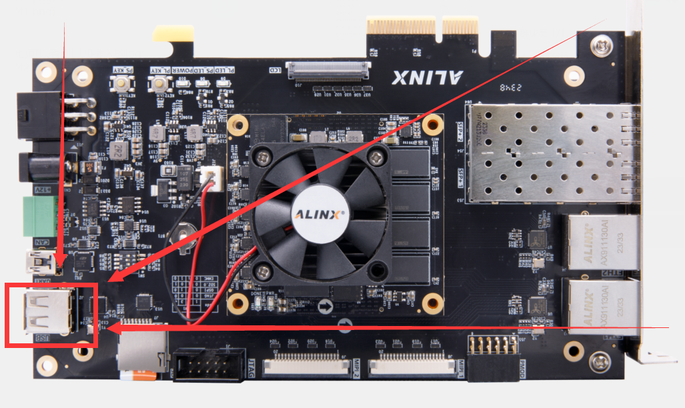
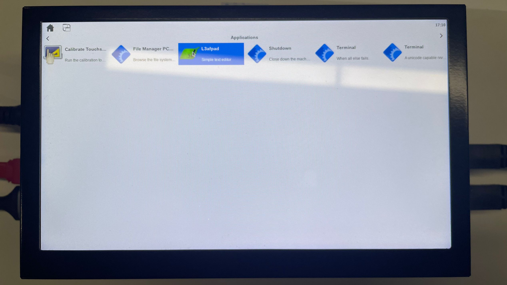
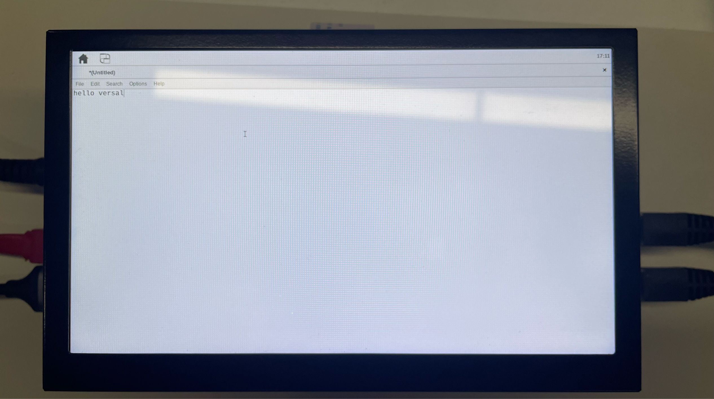
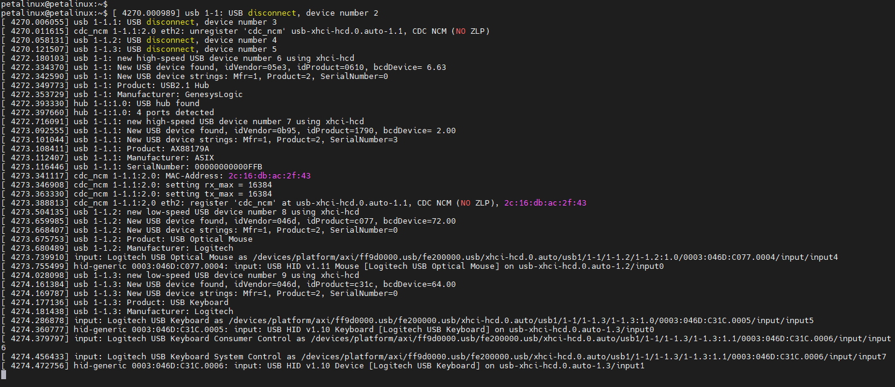

Chapter 5 USB
================================

| There is only one USB 2.0 interface in the VD100 development board.
| |IMG_256|
| Connect the USB HUB and connect the mouse and keyboard on the HUB, and you can use it with the Match Box desktop displayed on the LCD. For example, you can open **lL3afpad** a text editor and edit the content:
| |IMG_257|
| |IMG_258|

| The log inserted by HUB can also be seen in the serial port terminal:
| |IMG_259|

