Chapter 7 MIPI Camera
=====================================

-  | The MIPI camera interface is in this position on the VD100 development board:
   | |IMG_256|

-  | After the MIPI camera is connected, the status is as follows:
   | |IMG_257|

Display the MIPI camera in the Linux system of the development board
--------------------------------------------------------------------

-  | | STEP1: After the system is started and logged in, call the initialization script to initialize the IP related to the MIPI camera |
   | ``cd ~/test_apps/ && sudo./mipi_init.sh && cd ~``
   | |IMG_258|

-  | | STEP2: Run the ``sudo ~/test_apps/mipi_senser0_show`` program to display the MIPI1 camera |
   | |IMG_259|
   | |IMG_260|

-  | | STEP3: Run the ``sudo ~/test_apps/mipi_senser1_show`` program to display the MIPI2 camera |
   | |IMG_261|
   | |IMG_262|

PS: mipi _ senserx _ show program source code is here *demo/course_s2/applications/qtProject/mipi_camera*. For information on how to compile this program using QTCreator, refer to *4 _ Installing the QT and OPENCV libraries and setting the compilation environment in QTCreator.rst*.

You can also use the mouse to run these programs on the MatchBox desktop
------------------------------------------------------------------------

-  | STEP1: Click the File Manager PC.. Icons:
   | |IMG_263|

-  | Double-click the folder to enter the path where the program is located:
   | |IMG_264|

-  | Double-click the program to run, and click the Execute button in the lower right corner of the single computer after the pop-up window:
   | |IMG_265|

-  | Program execution:
   | |IMG_266|

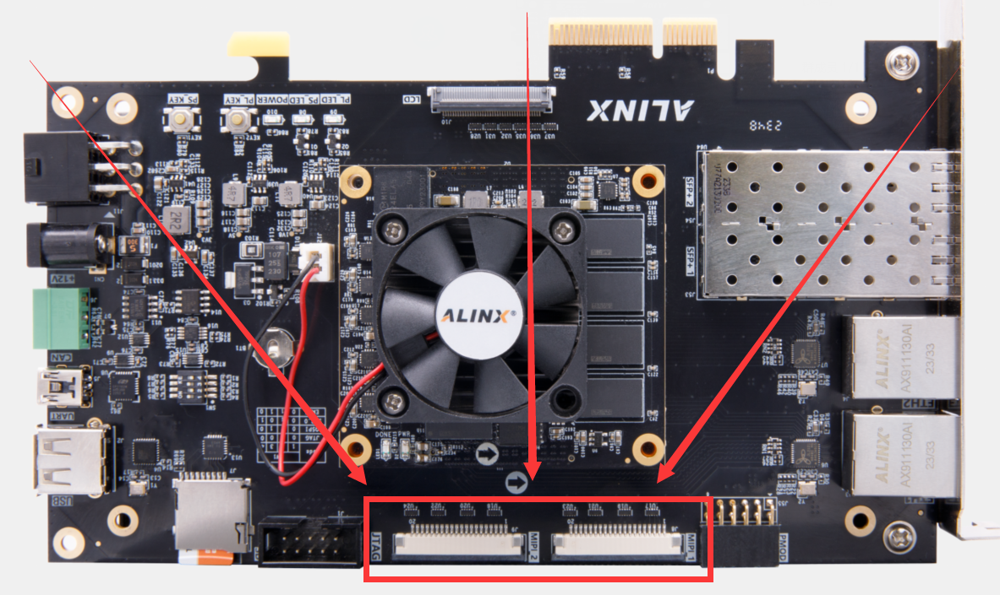
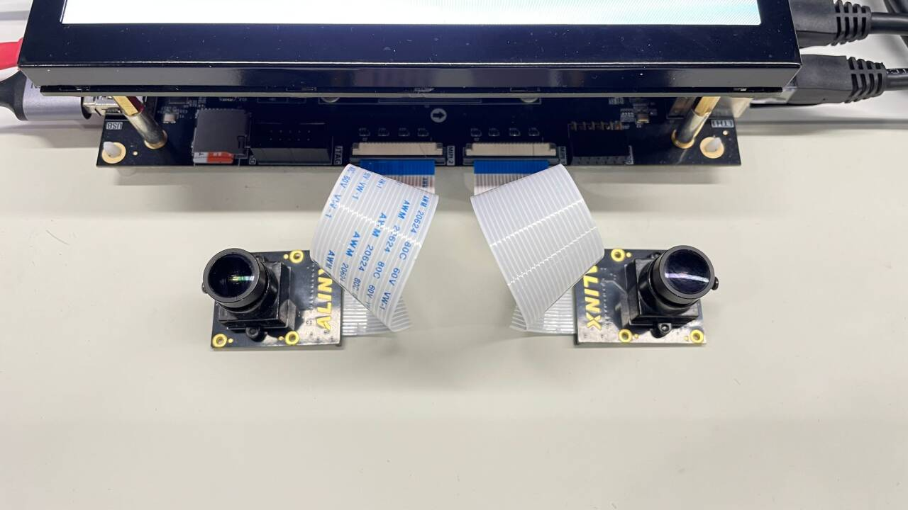
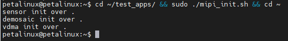
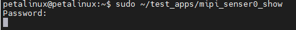
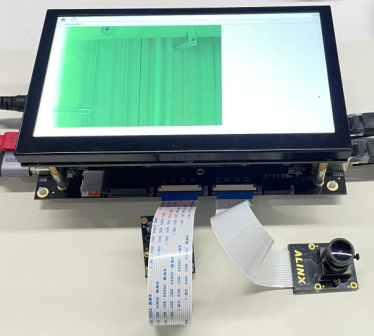
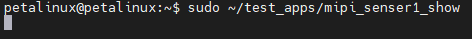
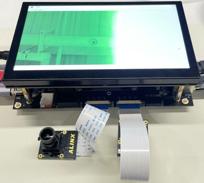
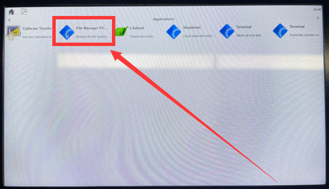
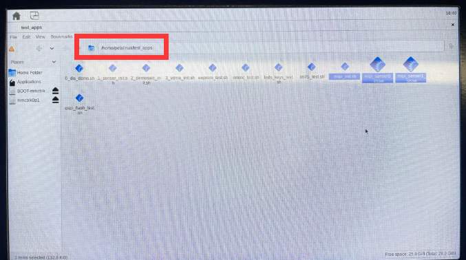
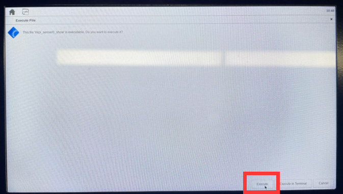
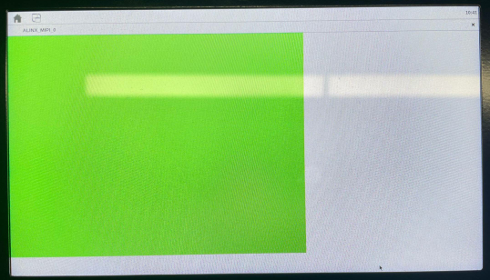
