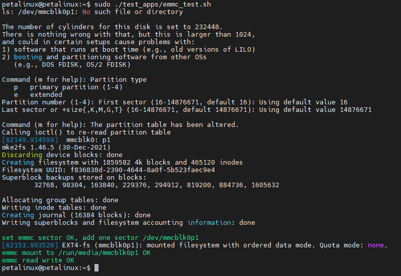

Chapter 8 EMMC
===============================

Using EMMC on a Linux system
----------------------------

| The operating file of EMMC in the Linux system is/dev/mmcblk0. To use EMMC in the Linux system, you need to set the partition, format the partition, and mount the partition. For example
| ``#If a partition already exists, unmount the partition first``
| ``sudo umount/dev/mmcblk0p1``
| ``#Delete a partition for /dev/mmcblk0 and create a new partition``
| ``echo "d``
|
| ``n``
| ``p``
| ``1``
|
|
| ``w``
| ``" | sudo fdisk/dev/mmcblk0``
| ``#Format the /dev/mmcblk0p1 partition into ext4 format``
| ``echo "y``
|
| ``" | sudo mkfs.ext4/dev/mmcblk0p1``
| ``#Mount /dev/mmcblk0p1 to /media/sd-mmcblk0p1``
| ``sudo mkdir/media/sd-mmcblk0p1 && sudo mount/dev/mmcblk0p1/media/sd-mmcblk0p1``
| Once mounted, you can manipulate the files in the mounted path, and these files will eventually be saved in the EMMC.

Test the EMMC using the system's built-in script
------------------------------------------------

| Run ``sudo ~/test_apps/emmc_test.sh`` :
| |IMG_256|

