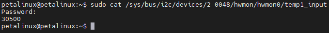

Chapter X LM75
================================

The LM75 is a digital temperature sensor chip made by Texas Instruments. It measures the ambient temperature and communicates with other devices via the I2C bus. It is a digital temperature sensor chip with stable performance, high precision and good reliability.

Using LM75 on a Linux system
----------------------------

| The temperature value collected by LM75 can be obtained by reading ``/sys/bus/i2c/devices/2-0048/hwmon/hwmon0/temp1_input`` directly in Linux. **单位是m°C**
| ``sudo cat/sys/bus/i2c/devices/2-0048/hwmon/hwmon0/temp1_input``
| |IMG_256|
| The temperature read here is 30500m ° C, which is 30.5 ° C.

