Installing the QT and OPENCV libraries and setting up the build environment in QTCreator
=========================================================================================================================

Install QT and OPENCV libraries
-------------------------------

-  | After the Petalinux project is compiled, execute the command: ``petalinux-build --sdk以获得sdk.sh``. Compiling the SDK. H is time-consuming. You can download what we have compiled `sdk.sh <http://www.alinx.vip:81/extra_support/2023_2_sdk_sh/sdk.sh>`_.
   | Copy the SDK. Sh to the Ubuntu system where QTCreator is located, open the terminal in the path where the SDK. Sh is located, and execute the command:
   | ``chmod +x./sdk.sh &&./sdk.sh``
   | |IMG_256|

-  | Prompt to enter the installation path, here I use the default path to install, after the installation is completed, you can see these files in the corresponding path:
   | |IMG_257|

-  | Unzip *demo/course_s2/libs/opencv4_include.tar.gz* and recursively replace the folder of the same name in the path shown in the following figure with the opencv4 folder obtained by unzipping:
   | |IMG_258|

Set the compilation environment in QTCreator
--------------------------------------------

-  | Open QTCreator, click Tools in the upper menu bar, and select Options:
   | |IMG_259|

-  | Add a Kits using the library from the previously installed SDK. Sh:
   | |IMG_260|
   | |IMG_261|
   | |IMG_262|
   | |IMG_263|
   | |IMG_264|
   | Click OK to save the settings.

-  | Open a QT project, for *demo/course_s2/applications/qtProject/mipi_camera* example:
   | |IMG_265|
   | |IMG_266|

-  | Select Versal Kits to compile:
   | |IMG_267|

-  | The executable file can be seen in the compilation result path.
   | |IMG_268|

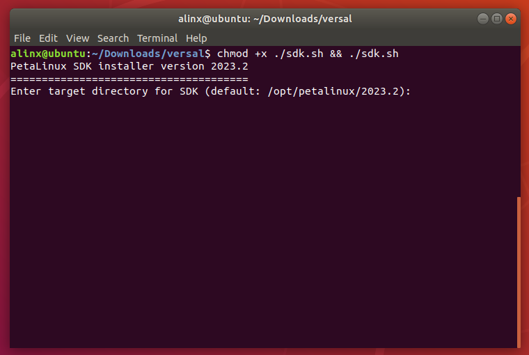
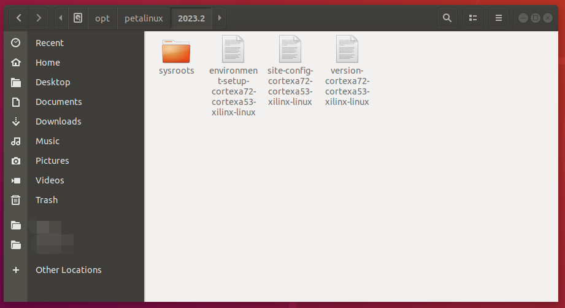
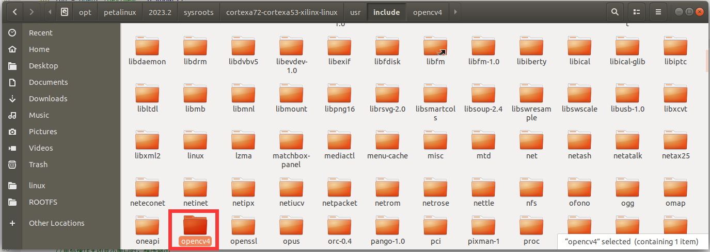
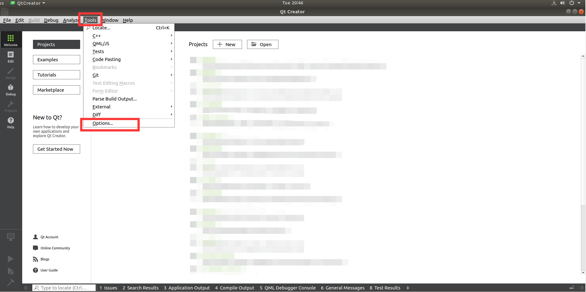
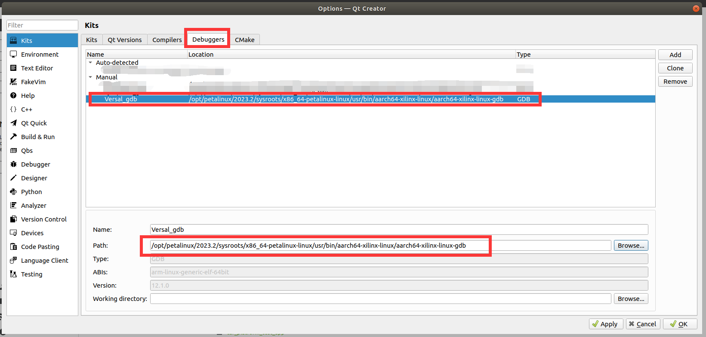
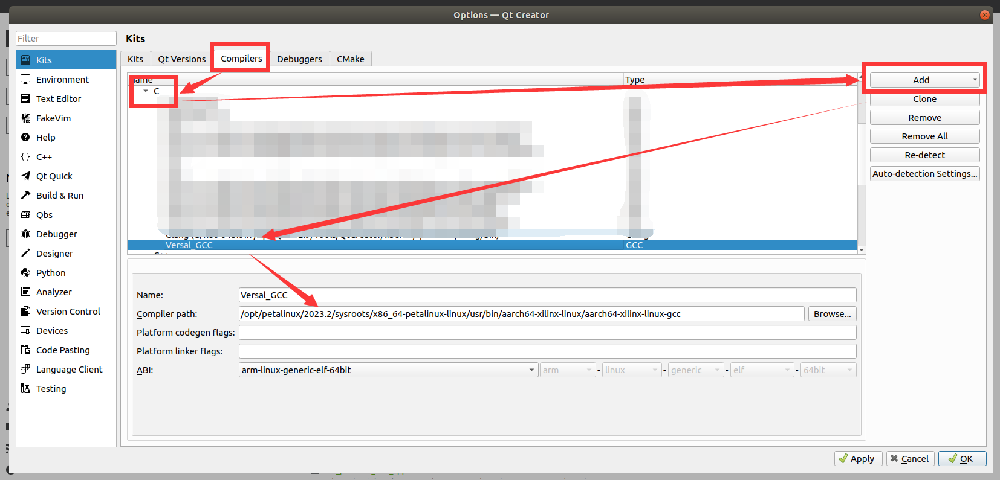
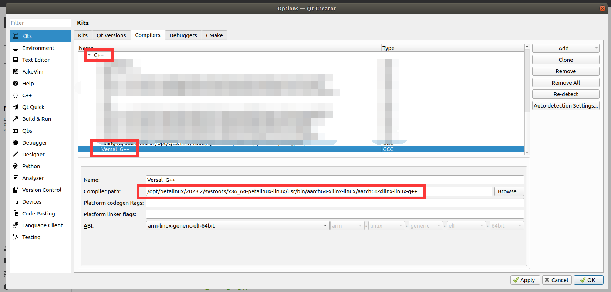
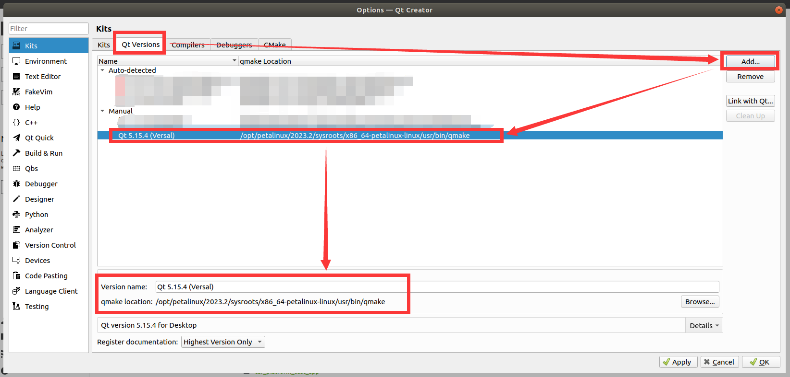
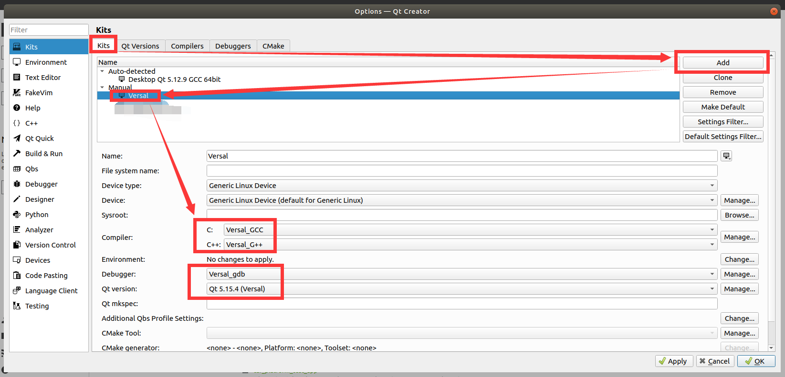
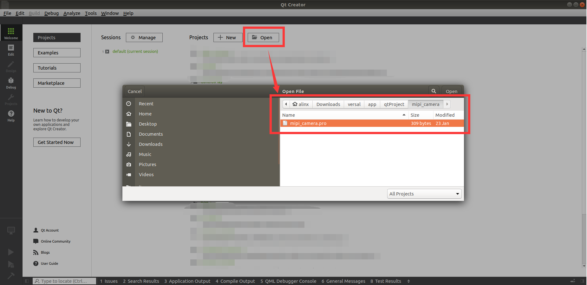
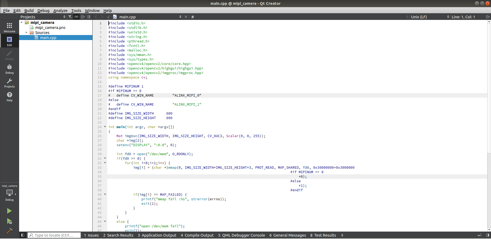
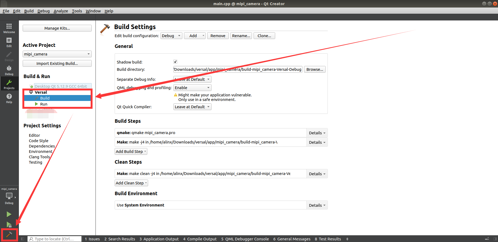
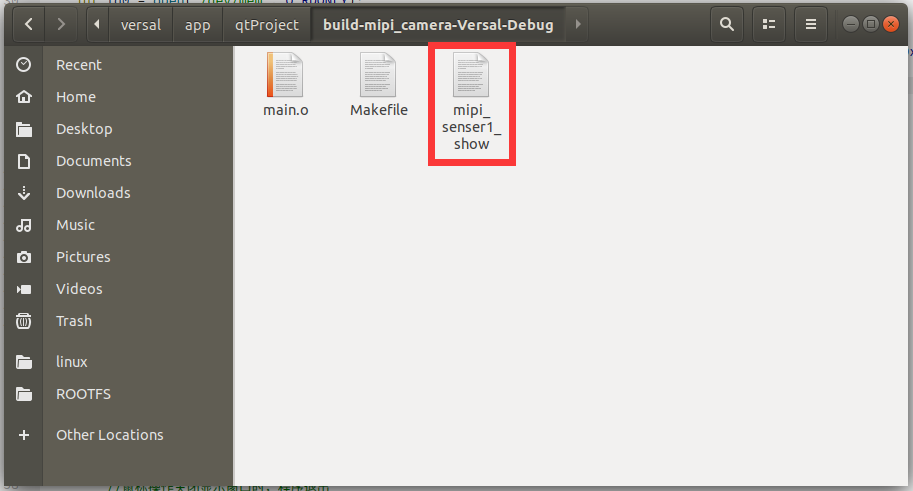
